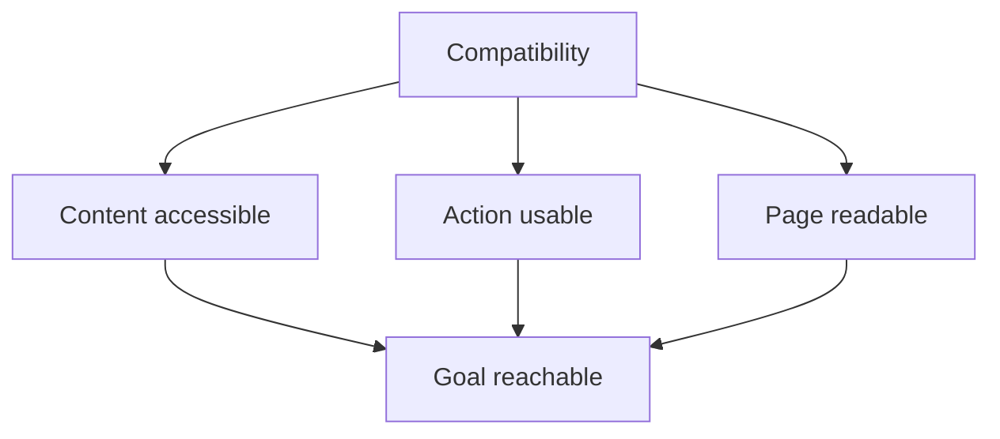

# 03.05. Browser Compatibility

The same web document is interpreted by different browsers, devices, and settings. Compatibility therefore does not mean that every pixel is put in the same place on every screen. The important question is whether the content can be understood and the essential task can be performed in the targeted environments.

## Prerequisites

- [HTML, CSS, and JavaScript](03-01-html-css-and-javascript.md) — the layers of the interface with different roles.
- [Rendering](03-03-browser-rendering.md) — how the displayed page is produced.

## What Are We Comparing?

A course page might look different on a phone, on a desktop computer, or with enlarged text. This in itself is not a bug. However, if the application link disappears, the button doesn't work, or the text is unreadable, the interface no longer fulfills its purpose. Compatibility must therefore be interpreted on multiple levels.

The content level asks whether the user has access to the necessary information. The operational level examines the interaction: can the task be started and finished. The presentation level pays attention to readability and layout. These are related, but not identical. A beautiful page can be unusable if its main action cannot be reached with a keyboard.

## Standards and Implementations

Web standards provide a common ground of interpretation for content creators and browsers. Even so, the support, operational details, or introduction time of certain features may differ. The creator must therefore check the essential paths of the page in the targeted environments. A page successfully opened in a single own browser does not prove general compatibility.

Using standard HTML elements often reduces the number of discrepancies. For example, a link and a button have known meaning and built-in behavior. If the same is attempted to be imitated by an arbitrary box element and a lot of custom JavaScript, more operational details have to be solved separately.

## Progressive Enhancement and Fallback Path

Progressive enhancement starts with a usable foundation. A course description can be read in HTML, CSS improves clarity, and a JavaScript function can add faster filtering. If this extra function is unavailable, the essential content and the path leading to application preferably remain. This is not valid for every application in the same form: a full browser-based image editor is built on a different basic operation than an informational page.

When using a more advanced browser capability, the program can check whether the given feature is available. We call this feature detection. Instead of deducing from the browser's name, it is worth examining the actual presence of the required function. In case the capability is missing, a clear fallback solution or understandable feedback is needed.

## Can I use?: Quick Check of Support

[Can I use?](https://caniuse.com/) collects support tables by browser versions for web technologies. We can search for IndexedDB or WebGL, for example, and then see in which browsers the support is full, partial, or missing. It is worth pausing at partial support and the notes of the table: even the green signal does not prove that the feature can actually be used successfully on a given device.

The site is a starting point for design, not a test of one's own application. The percentage usage data refers to the selected measurement scope, not automatically to our own users. After the table, we also check the important operation in the targeted browsers, and apply feature detection or a fallback solution at runtime where necessary.

## How Do We Check?

Checking should start from the user task. Can the page be opened? Is the essential information readable? Are the controls accessible by keyboard? Can the basic operation be finished on a narrow display and in a different browser as well? The browser's developer tools can help uncover display and program errors, but the real test is the complete task path.

Compatibility is not a one-time stamp. With changes in content and interface, new errors may appear. It is worth recording the environments and user paths that are actually important for the purpose of the course page.

## Common Misconceptions

| Statement | Clarification |
| --- | --- |
| "It's compatible if it looks exactly the same everywhere." | Basic usability is more important than pixel identity. |
| "If it works for me, it works everywhere." | One browser and setting is just one testing environment. |
| "Standards eliminate all discrepancies." | Support and environments may differ; checking is still needed. |
| "Checking the browser's name is enough." | It is advisable to examine the actual presence of the necessary capability. |

## Learned Concepts

- **Browser compatibility:** The usability of web content and basic tasks in the targeted browsers and environments.
- **Progressive enhancement:** Development built on a usable foundation, to which more advanced appearance and behavior are gradually added.
- **Feature detection:** Checking whether a necessary browser function is actually available.
- **Support table:** Information summarizing the known support of a web technology by browsers and versions. A design guide, not a substitute for checking actual operation.
- **Fallback solution:** A path that can be followed to the basic goal even alongside a missing or faulty advanced feature.
