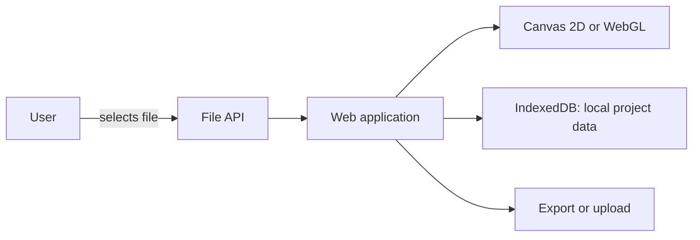
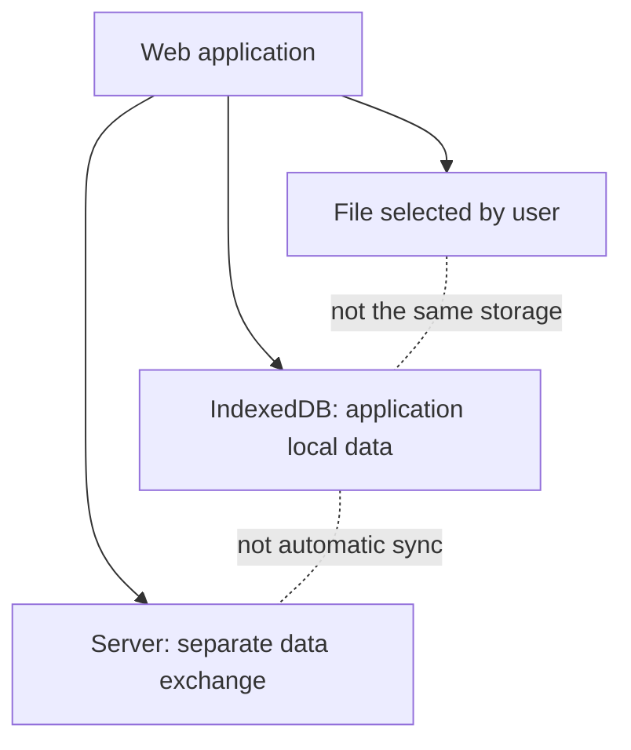

# 03.06. Browser capabilities and limits

The browser does more than just render HTML. A web application can draw two-dimensional or spatial images, process a user-selected file, store data locally, play media, and request certain device functions. All this happens through APIs mediated by the browser: the web page does not get unlimited access to the computer. It is worth seeing the purpose and limit of the various capabilities right now; the details of storage, offline operation, and permissions will follow later.

## Prerequisites

- [HTML, CSS, and JavaScript](03-01-html-css-and-javascript.md) — the role of programmable behavior.
- [Browser compatibility](03-05-browser-compatibility.md) — the concept of feature detection and fallback solutions.

## A browser-based editor uses multiple capabilities

A student opens a browser-based diagram editor. They select an image file from their own machine, modify it, and want to continue the work later. The editor may need file reading, drawing, and local storage. For a spatial model view, WebGL using the graphics hardware may also come in handy. These operations belong to different APIs and different access conditions; "the browser is capable of it" alone does not tell how the given step works.



The diagram shows a possible architecture. Reading the selected local file, the project stored in the browser's own storage, and uploading to the server are three separate operations. One does not automatically follow from the other.

## Browser API: mediated access

JavaScript uses programmable interfaces offered by the browser. Some APIs require user initiation, for others the browser may ask for explicit permission, and there are some that work without asking for separate permission. The conditions vary by API. Therefore, the application must handle not only support but also possible rejection, error, and available fallback paths.

The browser API is not the same as the web API offered by the server. Here we are talking about the possibilities provided by the browser to the web page: for example, reading a file object or the graphical drawing surface. Data exchange between the server and the client is the topic of a later API session.

## Local files: selection, reading, saving

The simple and widely used path is the file picker or drag and drop. The user selects a file; the **File API** can then make the selected file accessible to the page as a `File` object. For example, the application can read an image, display a preview of it, and then decide to work with it only locally, or upload it in a separate operation. Selection does not mean automatic upload, and the web page cannot read all the user's files at will.

```html
<label for="source">Choose image</label>
<input id="source" type="file" accept="image/*">
```

The HTML above only marks the interface for selection; further processing of the file requires program code. Some browsers also offer additional file system interfaces that allow reading and saving the file or folder selected by the user. Their support and conditions of use may differ. Therefore, it is not advisable to unnecessarily tie a simple file upload to a more advanced file system API.

## Local data storage: what is IndexedDB good for?

In the browser's own storage space, a web application can keep data for later visits. **IndexedDB** is a browser database API suitable for storing structured data. The diagram editor can, for example, store the elements and settings of an unfinished work so that the user can continue later. Reading and writing data happens through transactions. This is a different task than directly editing a local file selected by the user.

IndexedDB uses storage tied to the origin of the website; another page of foreign origin does not simply read the project out of it. However, local storage is not the same as a reliable backup with unlimited durability. The available space may be limited, data may be deleted, and it does not automatically appear on another device. Exporting important work or syncing it to a server must be planned separately.

`localStorage` is a simple key-value store, while IndexedDB is more complex and can also be used for larger structured datasets. `sessionStorage` is typically tied to the session of the given browser tab. This week it is enough to recognize the difference in roles; programming storage quotas, transactions, sync, and offline architecture is the subject of later deepening. Do not confuse the cookie with the browser-side project data repository: it works for a different purpose and under different rules, we will discuss it in detail at state management.



## Drawing: Canvas 2D and WebGL

**Canvas 2D** can be used for images drawn from a program, simple animations, or diagrams. **WebGL** can also work within a `canvas` element, but it is an API for interactive 2D and 3D rendering relying on graphics hardware. Semantic HTML or an easily interpretable diagram is often sufficient for a static figure on a course page; WebGL may be more justified for rotating a spatial model.

In addition to WebGL support, the graphical capability of the specific device and the graphic context that can be created also matter. The program must actually check if it successfully gets a WebGL environment; otherwise, it can provide a simpler view or text description. Drawn pixels in themselves do not convey the meaning of the drawn objects to assistive technologies. If the graphics carry information, an accessible alternative to them must also be planned.

## Media, location data, and notifications

HTML media elements provide an interface for playing audio and video. Through other APIs, the browser may also support the user's location data, camera or microphone use, or the display of notifications. With these, it is especially important that the purpose of the feature is clear, and that a meaningful state remains even after user rejection. A course page, for example, usually does not need an exact geographical location; if it offers a map feature, the text address of the location should also be available independently.

| Purpose | Possible browser capability | If unavailable |
| --- | --- | --- |
| Opening an image | File picker and File API | Clear error message or alternative input method |
| Continuing work later | IndexedDB | Export or server backup by separate decision |
| Interactive spatial diagram | WebGL | Simpler image or text description |
| Audio or video | Media element | The essential information is also available in another format |
| Location-based result | Location data API | Manual location entry |

## Availability, permission, and result

Let's ask three separate questions for each capability. Is the necessary API available in the given browser and environment? Are the conditions for use met, for example, a user file selection or permission? Did the operation itself succeed? For example, with WebGL, the name of the API may exist, but the creation of the graphic context may fail. For location data, rejection or a failed measurement is also a normal outcome.

The existence of the capability itself is not a reason to use it. The user's goal, data handling, and alternative path together determine whether a browser feature is a good choice. The detailed permission model, cookies, and the service worker aiding offline operation will follow on later occasions; here, the browser as a programmable but limited environment is the main takeaway.

## Common misconceptions

| Statement | Clarification |
| --- | --- |
| "A page can read any local file." | User file selection or properly secured access determines which file is available. |
| "Selecting a file is an automatic upload." | The page can process it locally as well; sending it to the server is a separate operation. |
| "IndexedDB is a project file visible to the user." | It is a database tied to the origin, stored in the browser by the application. |
| "Local saving is a secure backup." | The browser storage may be limited or cleared; export and sync are a separate task. |
| "WebGL is guaranteed to work on all devices." | The availability of the actual graphical environment must be checked. |
| "The existence of an API means certain success." | The conditions and the outcome of the operation are separate questions. |

## Concepts learned

- **Browser API:** The programmable interface offered by the browser to the web program, which makes features available under defined conditions.
- **File API:** An interface for handling the data of files selected by the user within the browser. Selection is not the same as uploading.
- **IndexedDB:** A browser database API tied to the origin of the website, which allows local storage and transactional handling of structured data.
- **Canvas 2D:** An interface for two-dimensional drawing created programmatically on the `canvas` element.
- **WebGL:** A browser graphics API that allows interactive 2D and 3D rendering using graphics hardware on a `canvas` surface.
- **Feature detection:** Checking whether the browser feature necessary for the application can actually be used.
- **Fallback solution:** A meaningful user path or information even besides a missing or failed capability.
