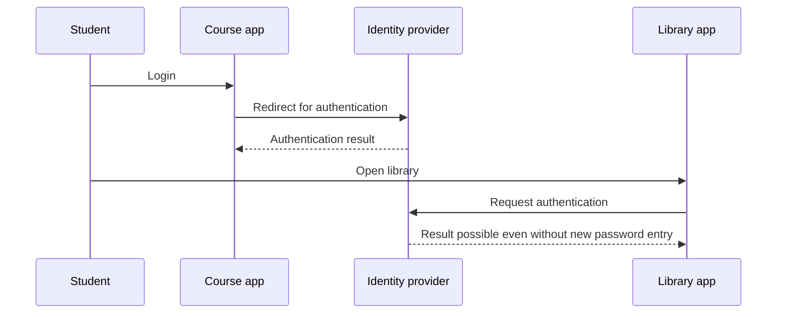

# 07.06. Single and external provider login

If a university uses multiple systems, a shared identity provider can be convenient for the student. Single sign-on, or SSO, aims for a user experience where an already verified identity can be used to log into multiple related applications. Logging in with an external provider can be built on similar redirects, but involves another organization's identity provider. Neither automatically resolves local permissions.

## Required prerequisites

- [Authentication and authorization](07-04-authentication-and-authorization.md) — the difference between login and operation permission.
- [OpenID Connect](07-05-oauth-and-openid-connect.md) — transferring identity to an application.
- [Session](07-02-cookies-and-sessions.md) — maintaining the logged-in state.

## University portal, library, and course system

The student would first log into the course system. The system redirects them to the university identity provider, where they prove themselves. The identity provider returns an appropriate result, and the course system creates its own session. Later, the student goes to the library system. It can also turn to the same identity provider; if the user still has a valid login state there, they can continue the process without entering a new password.

The diagram is a conceptual SSO flow. It doesn't mean that the two applications read each other's cookies. Both communicate with the shared identity provider and can maintain separate own sessions. If the central login has expired or further verification is needed, the student must prove themselves again.

## What does SSO provide?

Single sign-on can reduce repeated password entries, and organize the verification of identity in a central place. This does not necessarily mean a single session shared across all applications. The course system and the library can also use their own access rules, session durations, and logout operations. The identity provider helps determine who the user is; the local system decides what they can do.

Besides its advantage, SSO also creates dependency. If the central identity provider is unavailable, new logins can be hindered. Shared identification is also significant from a security perspective, so special attention must be paid to the protection of authentication and sessions. Detailed protection methods belong to next week's material.

## Login with an external provider

A website can offer for the user to log in at another organization's identity provider. The user gets to the provider via redirect, proves themselves there, and then the application receives verifiable identity information. A typical standard framework for this is OpenID Connect. The local application can then link its own user record and session to the identity.

The external provider does not automatically get rights to all the application's data, and the application does not necessarily get to know the user's external password. At the same time, the user must know which provider they are directed to, what data the application receives, and how the external identity is linked to their local account. Data management issues require separate consideration.

## Login, logout, access

After a successful login at the identity provider, the course system must also check its own API requests. A student cannot edit a teacher's course just because the shared login succeeded. Logout also doesn't always terminate every central and local session with a single button; the exact user experience depends on the agreement of the systems. The interface must therefore clearly indicate which application we logged out of.

## Common misconceptions

| Statement | Clarification |
| --- | --- |
| "In SSO, applications use each other's cookies." | They can rely on a shared identity provider, with their own sessions. |
| "Single sign-on = the same authorization in all applications." | Local authorizations are separate decisions. |
| "With external login, the application gets the external password." | In a standard redirect flow, the password stays with the provider. |
| "One logout definitely terminates all sessions." | The lifespans of central and local sessions can differ. |

## Concepts learned

- **Single sign-on (SSO):** An identity verification arrangement usable across multiple applications, which can reduce repeated authentication steps.
- **Identity provider:** A service that performs the user's authentication and provides verifiable information about it to other applications.
- **External login:** A login process in which the application relies on another organization's identity provider.
- **Local session:** A specific application's own user state maintained after a successful login.
