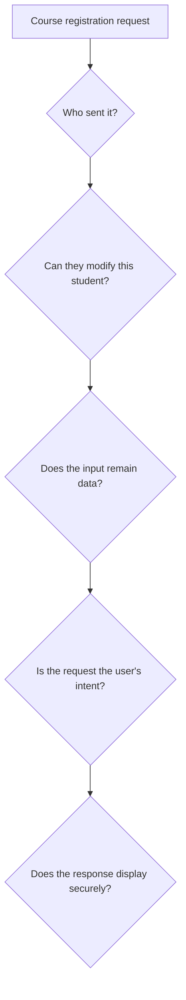

# 08.06. OWASP approach and security review of a web application

OWASP is an open professional community that helps with the secure design of web applications through guides and risk summaries. The lists do not replace the threat model of one's own system, but they provide a good checking framework: what error families should we think about when designing or reviewing an application?

## Required prior knowledge

- [Threat model](08-01-threat-models-and-trust-boundaries.md) — the protected values of the local system.
- [XSS, CSRF and injection](08-03-xss-csrf-and-injection.md) — different attack paths.
- [Passwords, MFA and sessions](08-04-passwords-mfa-and-sessions.md) — protection after login.

## What is the OWASP Top 10 good for?

The OWASP Top 10 categorizes common, important security risks of web applications. The categories and their order may change per edition. For example, the 2025 edition also includes broken access control, injection, and authentication failures. The list is not ten tickable tests: even within a single category, there can be multiple different errors and protective decisions.

Besides the Top 10, the OWASP Cheat Sheet Series gives targeted, detailed guides for example on XSS prevention, CSRF protection, password storage, and session management. When using them, the specific application's technology and current documentation must be taken into account. A general list does not replace an understood data flow.

## Analysis of a flawed registration process

Imagine a course registration API. The browser sends the course and student identifiers in the request; the server only checks if a logged-in session exists, then concatenates the two identifiers into SQL. The interface renders the course comment as HTML without checking. The page works on HTTPS.

In this situation, HTTPS protects the connection between the browser and the server, but three separate application errors remain. Freely providing the student identifier can lead to an operation in someone else's name if there is no server-side authorization check. The concatenated SQL adds an injection risk. Displaying the comment as HTML is an XSS risk. If the operation relies on a cookie-based session, the CSRF intent check must also be examined separately.

The order of examination is not a ranking, but tracking the request's path. At each node, we ask which party decides, what data it relies on, and what happens if the data is chosen by an attacker. For example, it's advisable to tie the student identifier to the session verified by the server, parameterize the database operation, handle the presentation in a text-safe manner, and provide the operation with appropriate CSRF protection.

## Responsibility is distributed among multiple actors

The browser enforces the same-origin policy, CORS, and cookie rules. The developer designs the application's data flow, output handling, and authorization checking. The operator manages the TLS endpoint, updates, secrets, and logging. The user's secure login habits also matter, but they cannot take the place of a faulty server-side check. The roles are interconnected, yet they represent separate responsibilities.

## Common misunderstandings

| Claim | Clarification |
| --- | --- |
| "The OWASP Top 10 lists every possible attack." | It highlights risk categories, not a complete threat model. |
| "If the ten items on the list are green, the system is secure." | The application's own data flows and changes must also be examined. |
| "The browser's security rules replace the server's check." | The server must independently authenticate and authorize operations. |

## Learned concepts

- **OWASP:** An open professional community publishing web application security knowledge and guides.
- **OWASP Top 10:** A periodically updated list summarizing important web application security risks.
- **Cheat Sheet Series:** Practical OWASP guides provided for specific security topics.
- **Security review:** Examination of data flows and controls based on a specific threat model.
