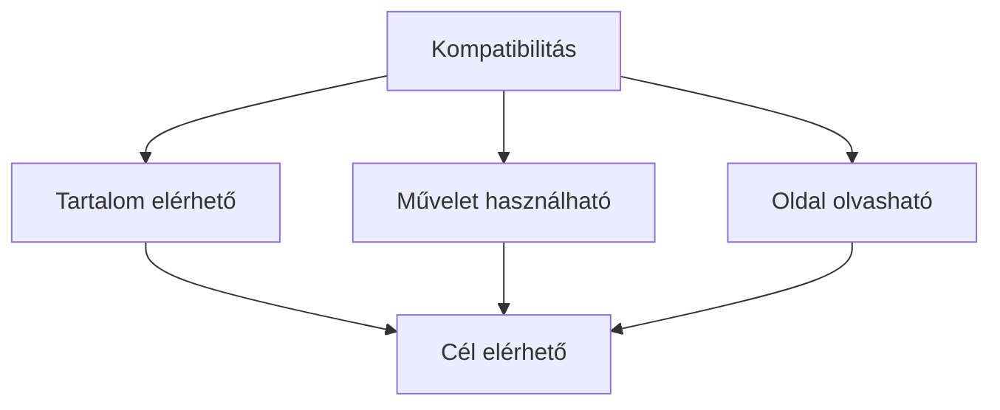

# 03.05. Böngészőkompatibilitás

Ugyanazt a webes dokumentumot különböző böngészők, eszközök és beállítások értelmezik. A kompatibilitás ezért nem azt jelenti, hogy minden képernyőn minden képpont azonos helyre kerül. A fontos kérdés az, hogy a tartalom megérthető és a lényeges feladat elvégezhető-e a célzott környezetekben.

## Szükséges előismeretek

- [HTML, CSS és JavaScript](03-01-html-css-and-javascript.md) — a felület különböző szerepű rétegei.
- [Renderelés](03-03-browser-rendering.md) — hogyan áll elő a megjelenített oldal.

## Mit hasonlítunk össze?

Egy kurzusoldal másképpen nézhet ki telefonon, asztali gépen vagy nagyított szöveggel. Ez önmagában nem hiba. Ha viszont a jelentkezési hivatkozás eltűnik, a gomb nem működik, vagy a szöveg olvashatatlan, a felület már nem teljesíti a célját. A kompatibilitást ezért több szinten kell értelmezni.

A tartalmi szint azt kérdezi, hogy a felhasználó hozzájut-e a szükséges információhoz. A működési szint az interakciót vizsgálja: el lehet-e indítani és be lehet-e fejezni a feladatot. A megjelenítési szint az olvashatóságra és az elrendezésre figyel. Ezek összefüggenek, de nem azonosak. Egy szép oldal használhatatlan lehet, ha a fő művelete nem érhető el billentyűzettel.

## Szabványok és megvalósítások

A webszabványok közös értelmezési alapot adnak a tartalom készítőinek és a böngészőknek. Ettől még egyes lehetőségek támogatása, működési részlete vagy bevezetésének időpontja eltérhet. A készítőnek ezért a célzott környezetekben kell ellenőriznie az oldal lényeges útvonalait. Egyetlen saját böngészőben sikeresen megnyitott oldal nem bizonyít általános kompatibilitást.

A szabványos HTML-elemek használata gyakran csökkenti az eltérések számát. Például a hivatkozásnak és a gombnak ismert jelentése és beépített viselkedése van. Ha ugyanezt egy tetszőleges dobozelem és sok egyedi JavaScript próbálja utánozni, több működési részletet kell külön megoldani.

## Fokozatos fejlesztés és tartalék út

A fokozatos fejlesztés használható alappal indul. Egy kurzus leírása HTML-ben elolvasható, a CSS javítja az áttekinthetőséget, egy JavaScript-funkció pedig gyorsabb szűrést adhat. Ha ez az extra funkció nem érhető el, a lényeges tartalom és a jelentkezéshez vezető út lehetőleg megmarad. Ez nem minden alkalmazásra ugyanabban a formában érvényes: egy teljes böngészős képszerkesztő más alapműveletre épül, mint egy tájékoztató oldal.

Egy fejlettebb böngészőképesség használatakor a program ellenőrizheti, hogy az adott lehetőség rendelkezésre áll-e. Ezt képességvizsgálatnak nevezzük. A böngésző nevéből való következtetés helyett a ténylegesen szükséges funkció meglétét érdemes vizsgálni. A képesség hiánya esetén világos tartalék megoldás vagy érthető visszajelzés kell.

## Can I use?: támogatottság gyors ellenőrzése

A [Can I use?](https://caniuse.com/) böngészőverziók szerinti támogatottsági táblázatokat gyűjt webes technológiákhoz. Rákereshetünk például az IndexedDB-re vagy a WebGL-re, majd megnézhetjük, mely böngészőkben teljes, részleges vagy hiányzó a támogatás. A részleges támogatásnál és a táblázat megjegyzéseinél érdemes megállni: a zöld jelzés sem bizonyítja, hogy egy adott eszközön a funkció ténylegesen sikeresen használható.

Az oldal tervezési kiindulópont, nem a saját alkalmazás tesztje. A százalékos használati adat a kiválasztott mérési körre vonatkozik, nem automatikusan a saját felhasználóinkra. A táblázat után a fontos műveletet a célzott böngészőkben is ellenőrizzük, és futás közben képességvizsgálatot vagy tartalék megoldást alkalmazunk, ahol szükséges.

## Hogyan ellenőrizzük?

Az ellenőrzés a felhasználói feladatból induljon ki. Megnyitható-e az oldal? Olvasható-e a lényeges információ? Elérhetők-e a kezelőszervek billentyűzettel? Befejezhető-e az alapművelet szűk kijelzőn és eltérő böngészőben is? A böngésző fejlesztői eszközei segíthetnek a megjelenési és programhibák feltárásában, de az igazi próba a teljes feladati útvonal.

A kompatibilitás nem egyszeri pecsét. A tartalom és a felület változásával új hiba jelenhet meg. Érdemes azokat a környezeteket és felhasználói útvonalakat rögzíteni, amelyek a kurzusoldal célja szempontjából ténylegesen fontosak.

## Gyakori félreértések

| Állítás | Pontosítás |
| --- | --- |
| „Kompatibilis, ha mindenhol pontosan ugyanúgy néz ki.” | Az alapvető használhatóság fontosabb a képpontok azonosságánál. |
| „Ha nálam működik, mindenhol működik.” | Egy böngésző és beállítás csak egy vizsgálati környezet. |
| „A szabványosság minden eltérést kizár.” | A támogatottság és a környezetek eltérhetnek; ellenőrzés továbbra is kell. |
| „Elég a böngésző nevét ellenőrizni.” | A szükséges képesség tényleges meglétét célszerű vizsgálni. |

## Megismert fogalmak

- **Böngészőkompatibilitás:** A webes tartalom és alapvető feladatok használhatósága a célzott böngészőkben és környezetekben.
- **Fokozatos fejlesztés:** Használható alapra épülő fejlesztés, amelyhez a fejlettebb megjelenés és viselkedés fokozatosan társul.
- **Képességvizsgálat:** Annak ellenőrzése, hogy egy szükséges böngészőfunkció ténylegesen elérhető-e.
- **Támogatottsági táblázat:** Böngészők és verziók szerint összegzett információ egy webes technológia ismert támogatásáról. Tervezési támpont, nem helyettesíti a tényleges működés ellenőrzését.
- **Tartalék megoldás:** A hiányzó vagy hibás fejlettebb funkció mellett is követhető út az alapvető célhoz.
