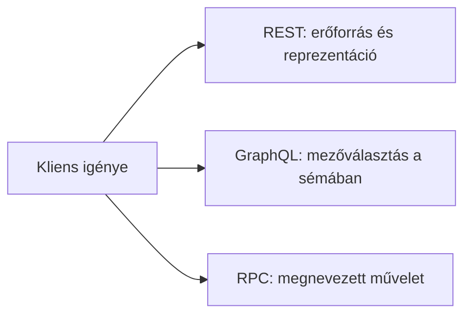

# 05.04. GraphQL és RPC: két másik API-szemlélet

Nem minden webes adatcsere azonosítható erőforrások köré szerveződik. A GraphQL-ben a kliens egy sémában leírt adatokból kérhet meghatározott mezőket; az RPC-szemléletben pedig névvel jelölt távoli műveletet hív. Ezek nem a REST „fejlettebb” vagy „elavult” változatai, hanem más hangsúlyt adó kapcsolódási minták.

## Szükséges előismeretek

- [API-szerződés](05-01-what-is-a-web-api.md) — a kliens és szolgáltató megállapodása.
- [REST és HTTP-erőforrások](05-03-rest-and-http-resources.md) — az összehasonlítás kiindulópontja.

## Egy kurzusfelület több adatforrással

A mobilfelület egy kurzus címét, oktatóját és a kapcsolódó órarend elemeit egyszerre szeretné megjeleníteni. Erőforrásokra szervezett API-nál ezek több címről is érkezhetnek, vagy a szerver olyan reprezentációt adhat, amely eleve tartalmazza őket. GraphQL esetén a kliens a lekérdezésben jelöli meg, mely mezőket szeretné. RPC-nél egy „kurzus áttekintésének lekérése” műveletet hívhat. A választás a feladat és a rendszer szerződésének kérdése.



## GraphQL: a kívánt mezők megnevezése

A GraphQL-szolgáltatás sémája leírja, milyen típusok és mezők kérhetők. A kliens lekérdezése kiválasztja a szükséges adatokat. Például fogalmilag így kérheti a kurzus címét és oktatójának nevét:

```graphql
query {
  kurzus(id: "42") {
    cim
    oktato { nev }
  }
}
```

Ez szemléltető példa, nem létező kurzus-API. A válasz adatai a lekérdezett mezők szerkezetét követik. A séma a szerződés fontos része; a kliens csak a támogatott mezőket kérheti. A GraphQL nem azt jelenti, hogy a kliens közvetlenül az adatbázisban futtat tetszőleges lekérdezést. A szerver ellenőrzi és végrehajtja a kérését, és saját szabályait alkalmazza.

A mezőválasztás segíthet, ha sokféle kliens eltérő adatigénnyel dolgozik. Másfelől a séma, a jogosultság, a teljesítmény és a hibák kezelése tervezést igényel. Az egyetlen végpontból érkező válasz nem automatikusan gyorsabb vagy egyszerűbb minden REST-erőforrásnál.

## RPC: műveletek a középpontban

Az **RPC** — remote procedure call, távoli eljáráshívás — azt a szemléletet emeli ki, hogy a kliens egy távoli, névvel jelölt műveletet kér. A `jelentkezesInditasa` vagy `orarendUtkuzesEllenorzese` fogalmilag művelet, nem pusztán egy erőforrás reprezentációjának lekérése. Az RPC lehet HTTP-n működő webes API, de maga az elv nem kötődik egyetlen adatformátumhoz vagy hálózati protokollhoz.

Egy művelet neve könnyen érthetővé teheti az alkalmazási szándékot. Ugyanakkor az API-nak itt is tisztáznia kell a bemenetet, a kimenetet, a lehetséges hibát és azt, hogy a hívás megismétlése milyen következménnyel jár. Ha egy jelentkezést véletlenül kétszer indítanak, a szervernek tudnia kell kezelni a helyzetet. Az RPC nem mentesít a szerződés következetes megírása alól.

## Hogyan hasonlítsuk össze őket?

REST-nél az erőforrás és a HTTP-művelet, GraphQL-nél a séma és mezőválasztás, RPC-nél a megnevezett művelet a természetes kiindulópont. Valós rendszerek vegyes megoldásokat is alkalmazhatnak. Egy könyvtári katalógus jól illik erőforrásos modellhez, egy sokféle felületen megjelenő összetett adat GraphQL-lel is jól kezelhető, egy célzott alkalmazási művelet pedig RPC-ként lehet világos. A technológia nevénél fontosabb, hogy a szerződés érthető és a kliens igényéhez illő legyen.

## Gyakori félreértések

| Állítás | Pontosítás |
| --- | --- |
| „GraphQL-ben a kliens közvetlenül az adatbázist olvassa.” | A kliens a szolgáltatás által meghatározott sémán keresztül kér adatot. |
| „RPC csak egy konkrét protokoll neve.” | Elsősorban műveletközpontú kapcsolódási szemlélet. |
| „GraphQL mindig egyetlen gyors kérés.” | A szerver munkája és az adatigény összetettsége továbbra is számít. |
| „Egyetlen stílus minden API-nál helyes.” | A feladat és a szerződés minősége dönt. |

## Megismert fogalmak

- **GraphQL:** Sémára épülő API-lekérdezési nyelv és futtatási modell, amelyben a kliens a kívánt mezőket nevezi meg.
- **Séma:** A GraphQL-szolgáltatás által kínált típusok, mezők és műveletek meghatározása.
- **Lekérdezés:** Adatkérés, amely GraphQL esetén a kívánt mezők szerkezetét is megadja.
- **RPC:** Távoli eljáráshívási szemlélet, amelyben a kliens megnevezett műveletet kezdeményez és választ kap.
