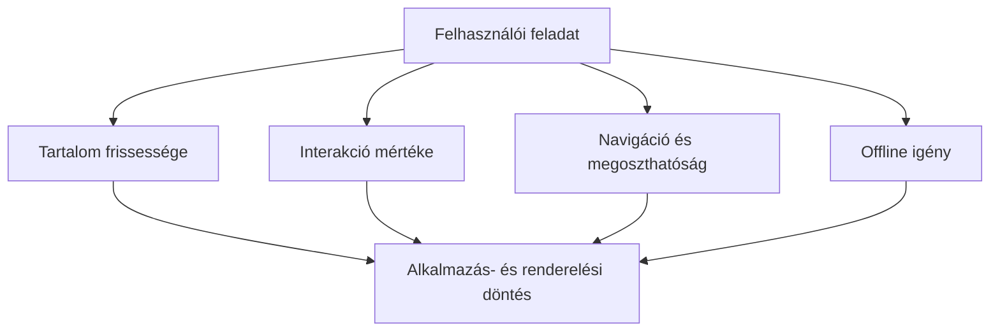

# 06.07. Alkalmazásmodell és renderelési stratégia választása

A többoldalas és egyoldalas modell, valamint a statikus, szerveroldali és kliensoldali renderelés nem előre meghatározott rangsor. A választás attól függ, milyen tartalmat kell megjeleníteni, milyen gyakran változik, mennyi interakció szükséges, és mi történjen lassú vagy hiányzó hálózatnál. A kurzusoldal, a jelentkezési felület és egy közös szerkesztő különböző választ is indokolhat.

## Szükséges előismeretek

- [MPA és SPA](06-01-multi-page-and-single-page-apps.md) — navigációs modellek.
- [CSR](06-02-client-side-rendering.md), [SSR](06-03-server-side-rendering.md) és [SSG](06-04-static-rendering-and-hybrids.md) — a fő tartalom előállításának helye és ideje.
- [Service worker](06-06-service-workers-and-offline.md) — offline elérés lehetősége.

## Három különböző feladat

Az egyetem hivatalos kurzusleírása sokaknak ugyanaz, ritkán változik, és fontos, hogy közvetlen linkről olvasható legyen. Egy statikusan előállított, többoldalas szerkezet jól illhet hozzá. A jelentkezési felület friss férőhelyadatot és szerveroldali döntést kíván; itt lehet értelme kéréskor előállított HTML-nek, API-frissítésnek vagy hibrid megoldásnak. A közös ábraszerkesztő sok helyi interakcióval és folyamatos adatcserével járhat; kliensoldali alkalmazásként természetesebb lehet. Ezek példák, nem kötelező technológiai előírások.

## Két külön döntési tengely

Először tisztázzuk, hogyan történnek a nézetváltások: rendszerint új dokumentumot kérünk, vagy a kliensprogram cseréli a nézetet? Ez az MPA–SPA tengely. Utána azt, hol és mikor áll elő a kezdeti fontos tartalom: előre, kéréskor a szerveren, vagy a böngészőben? Ez az SSG–SSR–CSR tengely. A két döntés összefügg, de nem olvad össze. Többoldalas statikus webhely, szerveroldalon előállított SPA-kezdőnézet és hibrid felület egyaránt lehetséges.

Az alkalmazás külön részei eltérő választ is kaphatnak. A kurzusleírás lehet statikus, a szabad helyek száma API-ból frissülhet, az űrlap ellenőrzése pedig részben a böngészőben történhet. A tényleges jelentkezést a szervernek kell elfogadnia vagy elutasítania. A „hibrid” nem öncélú összetettség: akkor indokolt, ha a részek frissességi és interakciós igénye valóban eltér.

## A döntés szempontjai

Az első fontos szempont az **első használható tartalom**. Ha egy oldal olvasásra szolgál, jó, ha a lényeges szöveg hamar megjelenik. A második az **interakció**: gyakori nézetváltás és helyi szerkesztés több kliensoldali programot kívánhat. A harmadik a **frissesség**: egy statikus leírás és egy pillanatnyi férőhelyszám más kezelést igényel. A negyedik a **megoszthatóság és navigáció**: egy konkrét kurzus URL-jének frissítés után és másik eszközön is működnie kell.

További szempont az eszközök teljesítménye, a hálózat megbízhatósága és az üzemeltetés összetettsége. Ha a felület nagy mennyiségű JavaScriptre épül, gyengébb eszközön később reagálhat. Ha minden kéréskor nehéz szerveroldali munkát végzünk, a válaszidő nőhet. Ha statikus tartalom mellett rossz a közzététel frissítése, régi adat maradhat kint. Nincs stratégia kompromisszum nélkül.

## Rövid összehasonlítás

| Helyzet | Lehetséges kiindulás | Figyelendő korlát |
| --- | --- | --- |
| Ritkán változó kurzusleírás | MPA és SSG | Újragenerálás frissítéskor |
| Személyes jelentkezési állapot | SSR vagy API-val frissülő nézet | Frissesség és szerveroldali ellenőrzés |
| Közös ábraszerkesztés | SPA és jelentős CSR | Programméret, kapcsolat, állapot-helyreállítás |
| Offline olvasható anyag | Bármely modell plusz service worker | Cache-frissesség és offline határ |

Ezek nem végleges receptek. A táblázat csak azt mutatja, hogyan indulhat el a tervezés a felhasználói feladatból. Egy valós rendszerben az adatvédelem, hozzáférhetőség, kereshetőség és csapatméret is módosíthatja a döntést; ezek egy részét későbbi hetek részletesebben vizsgálják.

## Gyakori félreértések

| Állítás | Pontosítás |
| --- | --- |
| „Az SPA mindig modern, az MPA elavult.” | Más feladathoz más navigációs modell lehet célszerű. |
| „SSG csak egyszerű, interakció nélküli oldalhoz jó.” | Statikus HTML mellett dinamikus elemek is működhetnek. |
| „SSR minden esetben gyorsabb, mint CSR.” | A szerver, hálózat és kliens munkája együtt számít. |
| „A service worker megold minden offline problémát.” | Csak a tervezett, tárolható tartalom és művelet működhet megfelelően. |

## Megismert fogalmak

- **Alkalmazásmodell:** A felület navigációját és kliens–szerver felelősségeit szervező megközelítés, például MPA vagy SPA.
- **Renderelési stratégia:** Annak megválasztása, hol és mikor áll elő a felület fontos tartalma.
- **Hibrid architektúra:** Eltérő oldalak vagy elemek számára különböző navigációs, renderelési és adatkezelési megoldások együttese.
- **Első használható tartalom:** A felhasználó alapvető céljához szükséges, megjelent és értelmezhető információ a felületen.
