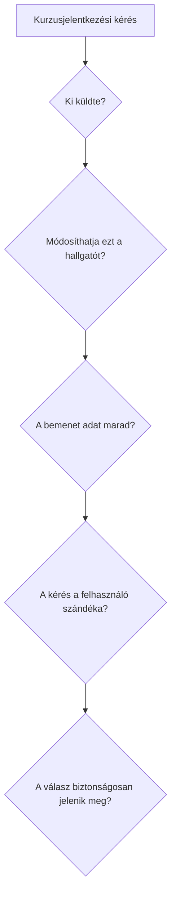

# 08.06. OWASP-szemlélet és egy webalkalmazás biztonsági áttekintése

Az OWASP nyílt szakmai közösség, amely útmutatókkal és kockázati összefoglalókkal segíti a webalkalmazások biztonságos tervezését. A listák nem helyettesítik a saját rendszer fenyegetési modelljét, de jó ellenőrző keretet adnak: milyen hibacsaládokra kell gondolni, amikor egy alkalmazást tervezünk vagy felülvizsgálunk?

## Szükséges előismeretek

- [Fenyegetési modell](08-01-threat-models-and-trust-boundaries.md) — a helyi rendszer védendő értékei.
- [XSS, CSRF és injekció](08-03-xss-csrf-and-injection.md) — eltérő támadási utak.
- [Jelszavak, MFA és munkamenetek](08-04-passwords-mfa-and-sessions.md) — belépés utáni védelem.

## Mire jó az OWASP Top 10?

Az OWASP Top 10 a webalkalmazások gyakori, fontos biztonsági kockázatait rendszerezi. A kategóriák és sorrend kiadásonként változhatnak. A 2025-ös kiadásban is szerepel például a hibás hozzáférés-ellenőrzés, az injekció és a hitelesítési hibák problémaköre. A lista nem tíz darab kipipálható teszt: egyetlen kategórián belül is több eltérő hiba és védelmi döntés lehet.

A Top 10 mellett az OWASP Cheat Sheet Series célzott, részletes útmutatót ad például XSS-megelőzéshez, CSRF-védelemhez, jelszótároláshoz és munkamenetkezeléshez. Használatuknál a konkrét alkalmazás technológiáját és aktuális dokumentációját kell figyelembe venni. Egy általános lista nem helyettesíti a megértett adatfolyamot.

## Egy hibás jelentkezési folyamat elemzése

Képzeljünk el egy kurzusjelentkezési API-t. A böngésző a kérésben küldi a kurzus- és hallgatóazonosítót; a szerver csak azt vizsgálja, hogy létezik-e bejelentkezett munkamenet, majd a két azonosítót összefűzve SQL-be illeszti. A felület a kurzus megjegyzését ellenőrzés nélkül HTML-ként jeleníti meg. Az oldal HTTPS-en működik.

Ebben a helyzetben a HTTPS védi a böngésző és a szerver közötti kapcsolatot, de három külön alkalmazási hiba marad. A hallgatóazonosító szabad megadása más nevében történő művelethez vezethet, ha nincs szerveroldali jogosultságvizsgálat. Az összefűzött SQL injekciós kockázatot ad. A megjegyzés HTML-ként való megjelenítése XSS-kockázat. Ha a művelet cookie-alapú munkamenetre támaszkodik, a CSRF-szándékellenőrzést is külön vizsgálni kell.

A vizsgálat sorrendje nem rangsor, hanem a kérés útjának követése. Minden csomópontnál azt kérdezzük, melyik fél dönt, milyen adatra támaszkodik, és mi történik, ha az adat támadó által választott. A hallgatóazonosítót például célszerű a szerver által ellenőrzött munkamenethez kötni, az adatbázis-műveletet paraméterezni, a megjelenítést szövegbiztos módon kezelni, és a műveletet megfelelő CSRF-védelemmel ellátni.

## A felelősség több szereplő között oszlik meg

A böngésző a same-origin policyt, CORS-t és cookie-szabályokat érvényesíti. A fejlesztő az alkalmazás adatfolyamát, kimenetkezelését és jogosultságvizsgálatát tervezi. Az üzemeltető a TLS-végpontot, frissítéseket, titkokat és naplózást kezeli. A felhasználó biztonságos belépési szokásai is számítanak, de nem vehetik át a hibás szerveroldali ellenőrzés helyét. A szerepek összekapcsolódnak, mégis külön felelősséget jelentenek.

## Gyakori félreértések

| Állítás | Pontosítás |
| --- | --- |
| „Az OWASP Top 10 minden lehetséges támadást felsorol.” | Kiemelt kockázati kategóriákat ad, nem teljes fenyegetési modellt. |
| „Ha a lista tíz eleme zöld, a rendszer biztonságos.” | Az alkalmazás saját adatfolyamait és változásait is vizsgálni kell. |
| „A böngésző biztonsági szabályai kiváltják a szerver ellenőrzését.” | A szervernek önállóan kell hitelesítenie és engedélyeznie a műveleteket. |

## Megismert fogalmak

- **OWASP:** Webalkalmazás-biztonsági tudást és útmutatókat közzétevő nyílt szakmai közösség.
- **OWASP Top 10:** Fontos webalkalmazás-biztonsági kockázatokat összefoglaló, időről időre frissülő lista.
- **Cheat Sheet Series:** Konkrét biztonsági témákhoz adott gyakorlati OWASP-útmutatók.
- **Biztonsági áttekintés:** Adatfolyamok és ellenőrzések vizsgálata meghatározott fenyegetési modell alapján.
