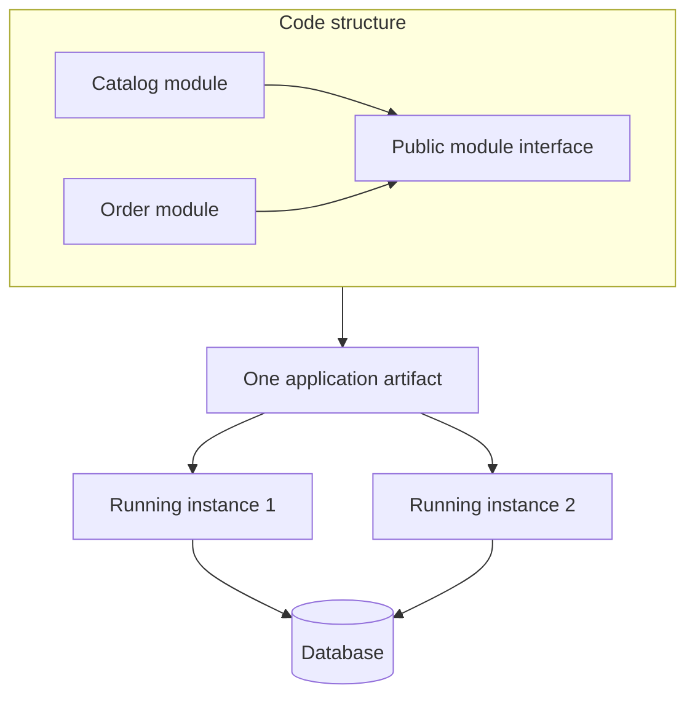

# 01.01. Architecture: code, processes, and deployment

A system's architecture describes its important parts, their relationships, and the decisions that constrain change. Before asking whether a system is a monolith or uses microservices, we need to identify the boundary we mean. Source folders, running processes, and deployable units represent three different views.

## Three distinct views

**Code structure:** what is each module responsible for, what does it export, and what does it use from other modules? Billing, catalog management, and customer management can be strictly separated within a single application. Compilation rules, package visibility, or architecture checks enforce this boundary.

**Runtime structure:** how many processes run, where do they keep state, and how do they communicate? Separate processes do not share a call stack or use direct function calls between them. Data must be turned into a message, transported, and interpreted at the other end. A single logical service can run multiple instances.

**Deployment structure:** what can be released and rolled back independently? If every change to five processes requires a coordinated release, deployment coupling remains strong despite the number of processes. Ten identical instances of a monolith are still multiple instances of one application.

The diagram contains two instances and several modules, yet the deployment unit is monolithic. We increased the instance count to handle load; we did not split the responsibilities into separate services.

## Architecture and technology choices

A programming language or framework does not determine the architecture by itself. The same language can implement a monolith or several independent services. A container is a packaging and execution tool: packaging an application in a container does not make it a microservice.

Evaluate a system using a concrete change. When a new payment method is added, how many modules and services must change? How many teams must coordinate? What can be deployed separately? What happens if the payment provider does not respond? Listing technologies does not answer these questions.

## Quality goals and measurable consequences

“Fast” and “scalable” are too vague as requirements. A useful goal might be that 95% of catalog-page responses arrive within 300 ms under a specified load; that updating the catalog does not require a billing release; or that orders can still be accepted when search is unavailable.

A decision affects several goals at once. A network boundary may enable independent scaling, but it increases latency and the cost of error handling. A local transaction is simpler, but it may tie components to a shared data model. There is no best architecture for every situation: we evaluate choices against requirements and organizational capabilities.

> [!important] Do not evaluate an architecture by counting boxes
> The number of modules, processes, and independently deployable services may differ. Always identify which boundary a diagram represents.

## Review questions

1. An application runs six instances. Does that make it a microservices system? Explain using its deployment units.
2. Two services have separate repositories but require a coordinated release. What coupling remains?
3. Define a measurable performance goal and an independent-deployment goal for the same system.
