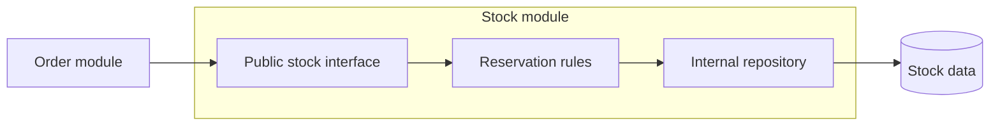

# 01.03. The modulith: a modular monolith with internal contracts

In this course, **modulith** means a modular monolith. We establish modules with independent responsibilities inside a single deployment unit. Modules interact through narrow, deliberately designed interfaces; their internal implementations and data access remain hidden.

## What makes a module boundary real?

A folder name is only a label. A boundary exists when other modules cannot reach arbitrarily into an implementation. For example, a catalog module might export `getProductSummary(productId)` without exposing its database connection or every internal entity.

The interface should express business meaning. `reserveStock` communicates more than `updateInventoryRow`: it names the intent and leaves rule enforcement to the stock module. The caller should not construct another module's internal state itself.

## Dependencies and data ownership

The dependency graph should preferably be clear and acyclic. If orders call stock, and stock calls back into internal order logic, the two modules may become a unit that changes together. A higher-level application coordinator or events can remove the cycle, but event semantics must also be designed.

Even with a shared database, ownership can be assigned to individual tables. The order module should not write directly to the stock table. Ownership rules prevent another module from bypassing invariants. Database permissions, separate schemas, and automated dependency checks can reinforce this agreement.

A shared transaction remains possible, but it is a deliberate choice. If an operation changes several modules' data in one transaction, this guarantee must be redesigned when extracting a service later. Modular structure does not make a move to microservices automatic.

## Benefits and limitations

A modulith retains the simplicity of local calls and a shared runtime while reducing internal coupling. It provides responsibilities that can be unit-tested separately and clear data ownership. A team can refine system boundaries incrementally without introducing network costs.

Deployment, process failure, and usually scaling remain shared. Modules do not gain independent network identities or separate availability boundaries. A common compilation can often check an internal interface's compatibility; a service API must also support old and new versions running together.

> [!tip] Make the boundary visible before extraction
> Before turning a module into an independent service, eliminate direct access to its internals. This exposes the actual calls and data requirements.

## Design check

Choose two modules and describe their public operations, data ownership, and permitted dependency direction. Give one change that replaces an internal implementation and another that changes the module interface. Explain why their effects differ.
