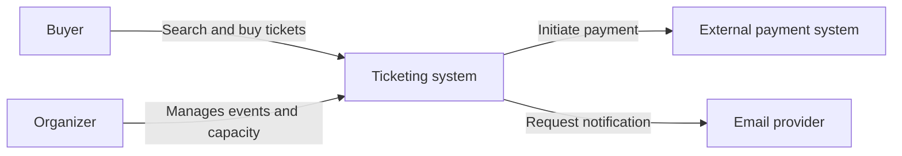
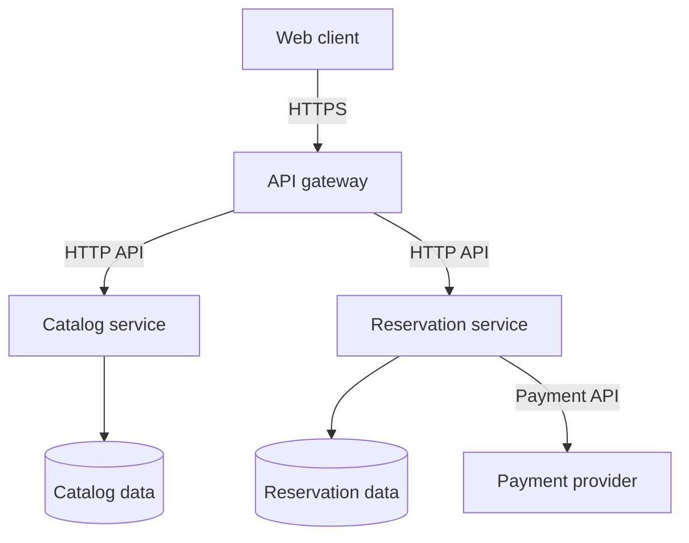
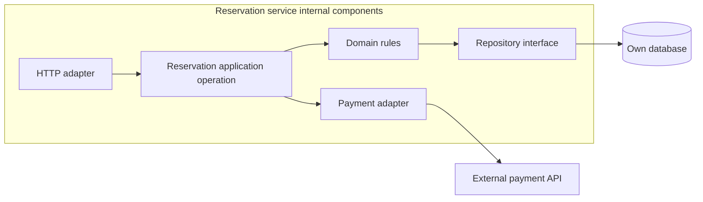
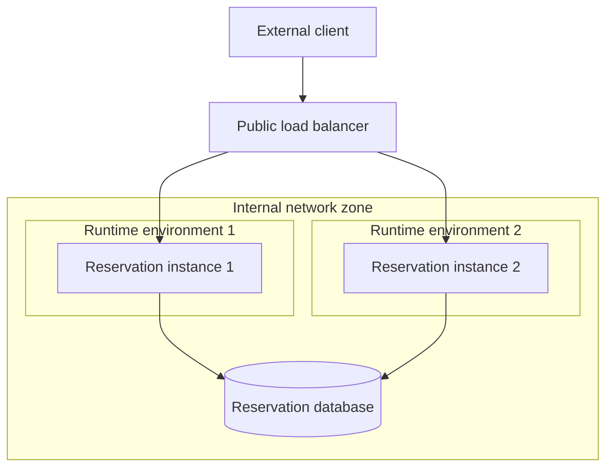

# 02.02. C4, component diagrams, and deployment views

A diagram answers a specific question. If we mix users, classes, database tables, and server instances in the same diagram, the reader does not know at what level to interpret the relationships. The C4 model provides views that can be zoomed into each other; from the four levels, we only use those necessary for the question.

## System context: what's outside and inside?

The context view shows the system under study as a single unit. Next to it are users and external systems. Here, it is not important whether REST or gRPC works internally: we explain who uses the system for what, and what external dependencies it has.

This is a C4-style context diagram with generic Mermaid notation. Boxes and arrows are not official C4 icons; the labels explain the view level and the meaning of its elements.

## Container: the executable units

A C4 container represents an application or data store, not necessarily a Docker container. A view can show a browser application, API, background worker, and database. In a microservice system, services can appear at this level.

Each arrow should be given a direction, purpose and communication method. The inscription "connected" is too little: it does not say who initiates, what is requested, and why the connection is necessary.

## Component: the inside of a unit

The component view exposes the internal responsibilities of a service: for example, HTTP adapter, booking application operation, domain model, repository, and payment adapter. Do not confuse these with separate processes. The component diagram explains the organization of the implementation, the container diagram explains the higher-level runtime boundaries.

The code-level view can show classes and interfaces. It is worth using when you really need to understand an internal solution. Automatic drawing of all classes is rarely a useful architecture document.

## Deployment: where are the instances running?

The deployment view shows machines, runtimes, network zones, and instances. It may turn out that three gateways and four reservation instances are running, but only one common database has a write role. This supports analysis of resources, availability, and trust boundaries.

The logical service and its instance are separate elements. If the diagram shows the same service four times, call it four replicas. When drawing two separate business responsibilities, do not call them instances of the same service.

The two instances belong to a logical service. The diagram shows the network and runtime placement, not two separate business services. The internal details of high availability of the database have been omitted here.

> [!tip] The title should answer a question
> “External connections of the reservation system” and “Deployment of three reservation service instances” are two separate diagrams. The title and legend should make this clear.

## Diagram checks

Check the view level, system limit, element responsibility and arrow meaning. Next to the figure, record which details you left out in a short text. Official description of C4 levels and additional views: [C4 diagrams](https://c4model.com/diagrams).
