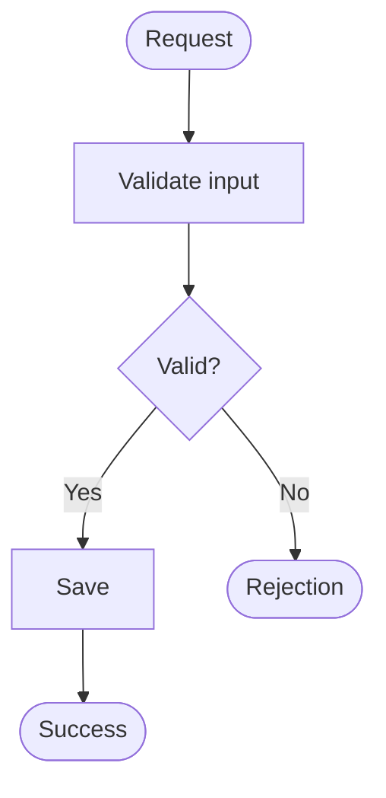

# 02.06. Creating diagrams with Mermaid: source, notation, and verification

In Mermaid, the diagram source is text. The diagram is not a collection of hand-placed shapes: we describe nodes, connections and rules, and the viewer creates a diagram from these. This can be well versioned, but the source and the result must be checked together.

## Flowchart source

In Markdown, the Mermaid source is placed in a code block with language notation `mermaid`. The following source is shown as text so that the markings can also be read:

```text
flowchart TD
  Start(["Request"]) --> Check["Validate input"]
  Check --> Valid{"Valid?"}
  Valid -->|"Yes"| Save["Save"]
  Valid -->|"No"| Reject(["Rejection"])
  Save --> Done(["Success"])
```

Rendered the same:



The identifiers `Start`, `Check`, and `Valid` can be reused in subsequent connections. A square bracket indicates a step, a curly bracket a decision, and a rounded mark indicates a start or end point in the convention chosen here. `-->` is a directed connection, `|"Yes"|` is an edge label. Always use notations in accordance with the purpose of the diagram.

## Structural grouping

`subgraph` frames related elements. It can mark a logical module boundary, a service interior, or an installation environment. The three are not the same: state their meaning in the title of the frame. For example, a figure legend might record that each outer arrow is a network call and the inner arrow is a local dependency.

Separating stable IDs from descriptive labels makes modification easier. Use accented and punctuated captions in quotation marks. Words included in the grammar, such as the terminator `end`, should not accidentally appear as node identifiers.

## Sequence diagram source

```text
sequenceDiagram
  participant C as Client
  participant S as Service
  C->>S: Request, requestId
  alt Success
    S-->>C: Result, requestId
  else Rejection
    S-->>C: Error code, requestId
  end
```

The order of participants affects readability. Use the arrow types consistently and describe in the text which message is a direct reply or a later notification. In the case of `par`, the branches can really run independently; mere drawing parallelism should not mask data dependence.

## State diagram source

```text
stateDiagram-v2
  [*] --> Queued
  Queued --> Running: worker picked it up
  Running --> Completed: success
  Running --> Failed: fatal error
  Completed --> [*]
```

`[*]` represents a start or end point depending on the environment. A transition tag tells the event or condition, not just repeating the name of the next state. The diagram should also include an explanation of the stored state and the forbidden transition.

## Semantic check

Parser success only proves grammatical correctness. A successful and an unsuccessful route must then be followed. Check that each decision branch has a consequence, each network boundary is visible, and the transitions in the state diagram are also explained by the sequence.

Split an overcrowded diagram into several views. A separate structural picture and a separate calling process can be useful for a chapter. Technology logos and colors do not replace the names of responsibilities. Color should not be the only carrier of information.

> [!tip] When making changes, check the rendered figure as well
> Source diff shows what connection has changed. The rendered view shows whether the layout and labels are still readable.

## Independent diagram exercise

Create three views of the same export process: a component diagram of the API and worker connection, a sequence of the start and result, a state diagram of the task's lifecycle. Then add a worker failure and run its consequence through all three views.
