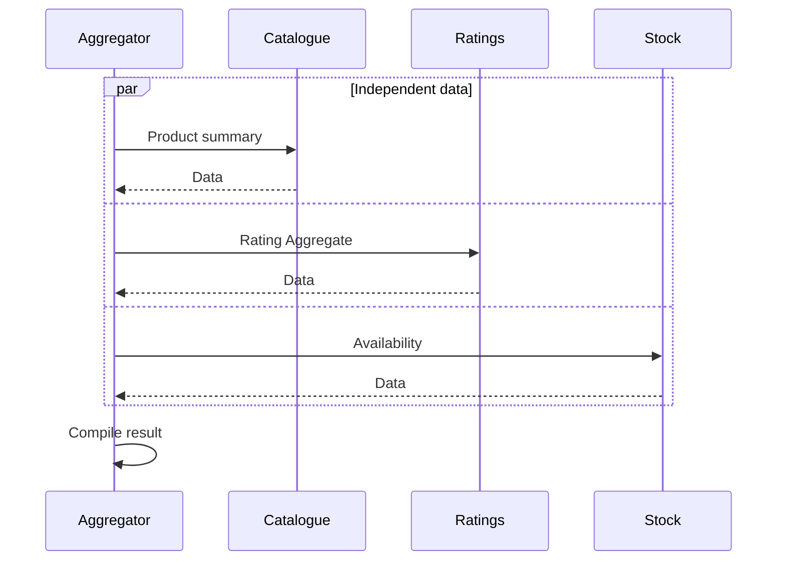

# 03.03. Latency, fan-out, and communication coupling

Inter-service communication performance is not described by the average response time of a single endpoint. The entire request path counts: the number of calls, their order, their parallelism and the amount of data transferred. A system composed of small services may even spend more time on communication than on business calculations.

## Serial and parallel calls

If a request makes four remote calls of 40 ms each in a row, these alone take about 160 ms. The entry point and the operation’s own processing time add to that total. When independent calls are started in parallel, the total time is closer to the time of the slowest call, but more simultaneous resource demands arise.

Parallelization does not resolve data dependencies. If the parameter of the second call is derived from the result of the first, both cannot be started at the same time. The plan should therefore show which data is available and when.

## Fan-out and tail latency

During fan-out, an incoming request initiates several internal calls. If all results must be waited for, the slowest dependency dictates completion. The more calls there are, the more opportunities there are for one of them to be slow.

The average can hide this phenomenon. The p95 and p99 latency helps to examine the slower request range. Percentiles cannot simply be added together in all circumstances; it is also necessary to measure the entire route. A distributed trace shows which calls ran sequentially, ran in parallel, or waited in a queue.

In a simple illustrative model, if three independent dependencies each have 99% availability and all three are required for success, the joint availability is `0.99³ ≈ 97.03%`. Real-world dependencies are often correlated, so this is not an SLA calculation, but an illustration of how stacking mandatory dependencies can reduce the success of the overall operation.

## Chatty API and batching

The connection is chatty when a business operation requires many small back-and-forth calls. After twenty items in a list, name, price, and inventory retrieved one by one can cause sixty additional calls. Summary endpoint, batching or targeted read model can reduce the cost.

A giant answer, on the other hand, can transmit too much data and create a tight contract. The goal is not to merge all calls, but to limit them to the specific consumption needs. We evaluate the size of the payload, the processing time and the possibility of the cache together.

## Dependencies that can be relaxed

Not all data is equally critical. If the rating summary is missing, the product page may still be displayed. If the result of the payment is not known, the purchase should not be considered successful. Degraded operation must be chosen according to business semantics, not with a general "empty list in case of error" rule.

> [!tip] Draw a call graph, not just a service list
> Mark mandatory and optional calls, parallel branches and time budgets on the graph of a specific request. This makes the propagation of latency and failure visible.

## Review questions

1. Why don't three separate fast endpoints prove a fast system?
2. When can fan-out be reduced with a read model?
3. In the absence of which data can a search page continue to function and what indication should it give?
