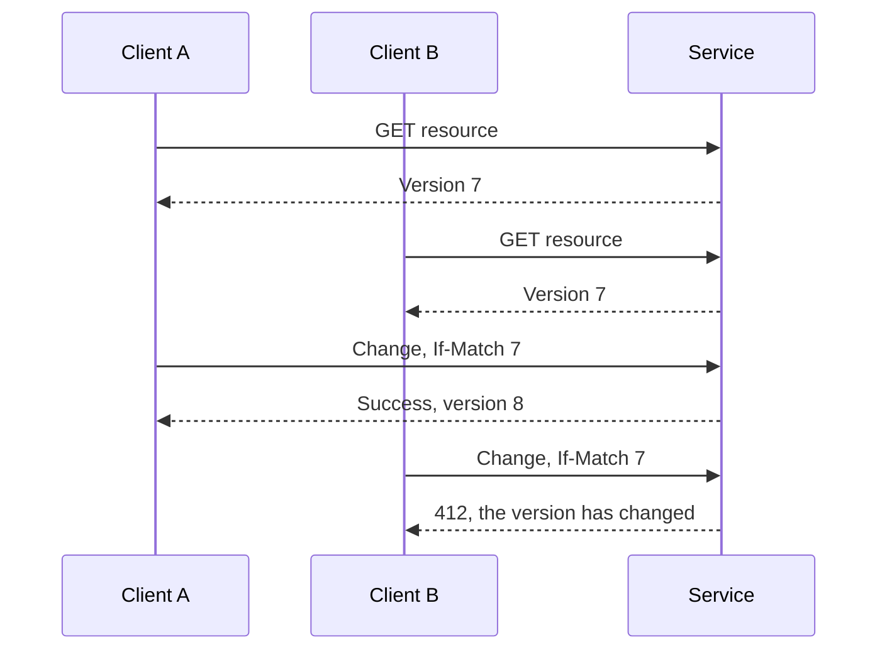

# 04.02. HTTP APIs: errors, caching, concurrency, and long-running operations

A usable HTTP API plans for errors and concurrent modification in addition to a successful example. The consumer must be able to distinguish between bad input, missing resource, collision, overload, and transient dependency error.

## Status and error representation

`201 Created` may indicate a created resource, `202 Accepted` accepted but not yet completed processing. `400` indicates a bad request, `401` missing or invalid authentication, `403` access denied, `404` a resource not found. `409` conflict, `412` failed precondition, `429` is used for too many requests. The status should be accompanied by a stable application error code and manageable details.

Do not force the client to compare human sentences. `code: "RESERVATION_EXPIRED"` can be managed programmatically, while the displayed text may vary from language to language. The error response should not disclose the internal stack trace and secret configuration.

## Cache and conditional read

The cache can reduce the cost of repeated requests, but the rules of data freshness and sharability must be specified. A public event catalog requires different cache management than a personal account list. Proxy and browser storage should also be considered.

A `ETag` can identify the version of the representation. A client can indicate that it already has a version with the `If-None-Match` condition; in unchanged state, the server can give a `304` response. This means less data transfer, but it does not make server-side checking cost-free.

## Concurrent modification

If two clients read the same old state, the second change could overwrite the first. A conditional write based on, for example, `If-Match` and a strong ETag only succeeds if the known version of the client is still current. The server must validate the check and the write together.

After a collision, the client can re-read the state and decide with the user. Automatic resubmission with the latest version is dangerous if it overwrites the other's changes without approval.

## Long-running operations and pagination

It is not necessary to wait for a large export in an open request. The server can create a task resource, return its ID, and then the client asks for status. The contract should record the place of the completed result, the error, the expiration date and the possibility of interruption.

For lists, paging limits the size of the response. Offset is simple, but elements can be shifted in a changing data set. The cursor can indicate an agreed sorting point. A stable sort often requires a sort key supplemented with an identifier; arbitrary database order is not an appropriate contract.

> [!important] OpenAPI describes what you designed
> Schema, examples and generated client help with collaboration. They do not decide for you the meaning of repetition, authorization, concurrency and business errors.

## Contract checks

For a state-changing API, check for bad input, missing authorization, version conflict, lost response, and repeated request. Record the expected status and status change for these. Do not plan the operation of the client based only on the successful response body.
