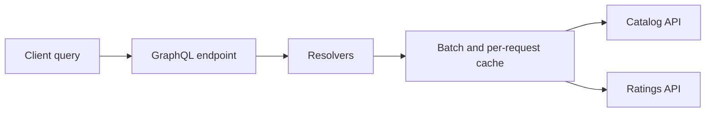

# 04.04. GraphQL: schemas, resolvers, and data composition

GraphQL uses a typed schema to describe the data and operations available to the client. The client selects the required fields in a query. The server generates these with resolvers, even using several data sources or services.

## Schema and query

The schema is not an automatic mirror of the database. It describes concepts exposed to consumers. A product type can contain catalog data, rating and availability, while these come from three separate data owners.

```graphql
type Product {
  id: ID!
  name: String!
  price: Money!
  rating: Float
}

type Money {
  amountMinor: Int!
  currency: String!
}

type Query {
  product(id: ID!): Product
}
```

```graphql
query ProductCard($id: ID!) {
  product(id: $id) {
    id
    name
    price { amountMinor currency }
  }
}
```

The client does not request a rating, so the server does not need to produce one if the implementation actually follows the field requirement. Controlling the requested fields can reduce over-large representations, but does not guarantee a cheap query by itself.

## Query, mutation and subscription

Query describes a read operation, mutation a state change. The name and return type of the mutation field is a business contract: for example, the expiration date and manageable rejection can be returned in addition to the created reservation.

The subscription can give more results in time. The GraphQL model and the transport of messages are separate issues: subscription alone does not determine whether we use WebSocket or another transport. The specific protocol, authentication and reconnection are recorded in the contract of the used solution.

## Resolvers and N+1

A list resolver returns twenty products. If the resolver of each product's `rating` field makes a separate remote call, the result can be one initial call and twenty additional calls. This is one manifestation of the N+1 problem. With batching, we process several identifiers in one request; with a per-request cache, we can also reduce repeated data retrieval.



Batching must not introduce a shared cache that leaks data between users with different permissions. Data retrieval optimization cannot bypass access rules.

## Cost, errors and cache

Query depth, complexity, number of items and execution time should be limited. A type-valid query can still trigger many service calls or retrieve large data sets. Paging is also important in the schema, not just for REST lists.

A GraphQL response can contain data and errors at the same time. Nullability affects how an error in a field is propagated in the response. The client must also interpret the partial result. Because of the unified endpoint, the HTTP status alone does not always tell the result of the entire query.

Caching is possible, but using HTTP cache based on resource URIs is less direct. Persisted query, stable identifiers and client-side normalized cache can help; these do not render the freshness and authorization rules unnecessary.

> [!important] There can be many calls behind a client request
> GraphQL can reduce the number of client-initiated requests while still experiencing significant fan-out on the server. The entire execution graph must be measured.

## Federation and selection

During federation, several subschemas can appear in a common graph. This requires organizational and schema owner cooperation; the meaning of a common field is not resolved by schema concatenation. GraphQL can be especially useful for clients with different data needs and complex reading interfaces. For a simple internal command interface, REST or RPC may be suitable.

Additional concepts: [GraphQL queries](https://graphql.org/learn/queries/), [schema](https://graphql.org/learn/schema/), [performance](https://graphql.org/learn/performance/).
