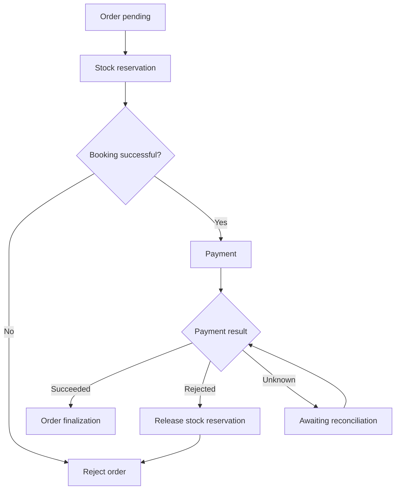

# 07.02. Sagas: orchestration, choreography, and compensation

Saga implements business processes involving multiple services through a series of local transactions. If a later step fails, earlier steps may include compensatory actions. A saga is not a shared ACID transaction: intermediate states may be visible and recovery may take time.

## Steps in a process

We reserve stock for an order, request payment, and then finalize it. The inventory owner modifies his own status, the payment belongs to another data owner, and the order status is recorded by the order management. Each step receives a separate result and identifier.

The "unknown" status is not the same as an error. A persistent operation identifier and a rule are required for subsequent reconciliation. The figure shows a simple model; an error in compensation may require an additional recovery state.

## Orchestration

With orchestration, a coordinator tracks the process state and initiates the next command. You can see where the process is, which step is pending and what compensation is required. The persistent state of the coordinator must be able to continue even after a restart.

The advantage is clear control and process rules described in one place. Its cost is the coordinator's contract, availability and management of the central process logic. The coordinator should not take over the services' own internal invariants.

## Choreography

With Choreography, services react to events. The creation of an order can trigger a stock reservation, the event of the reservation can trigger a payment, and the result of the payment can trigger a finalization. There is not necessarily a single controller, but the entire process still exists and requires monitoring.

For few, well-understood reactions, this can reduce central dependency. With many branches and cycles, the process can become difficult to follow. An apparently simple event subscription by a new consumer can introduce a new business feedback loop.

## Compensation is a business operation

Compensation is not time travel. Reversing a debit is a new financial transaction, not the deletion of the original record. After releasing a reservation, someone else can take the inventory. Saga does not automatically ensure that other operations do not see the intermediate state.

A compensating command can also repeat itself and cause errors. It requires its own idempotency, retry and final reconciliation path. If automatic recovery is not possible, the system must provide a recognizable, traceable state.

> [!warning] Saga is not a distributed rollback
> The effects of local transactions may already be visible to other operations. Compensation settles the business consequence according to the allowed rules.

## Design exercise

Write an orchestration and choreography plan for the same order process. Indicate who stores the status, where the entire operation can be tracked, and what happens if the order service fails after payment. Do not assume a one-time or perfectly ordered message delivery in the response.

Pattern description: [Saga pattern](https://microservices.io/patterns/data/saga.html).
