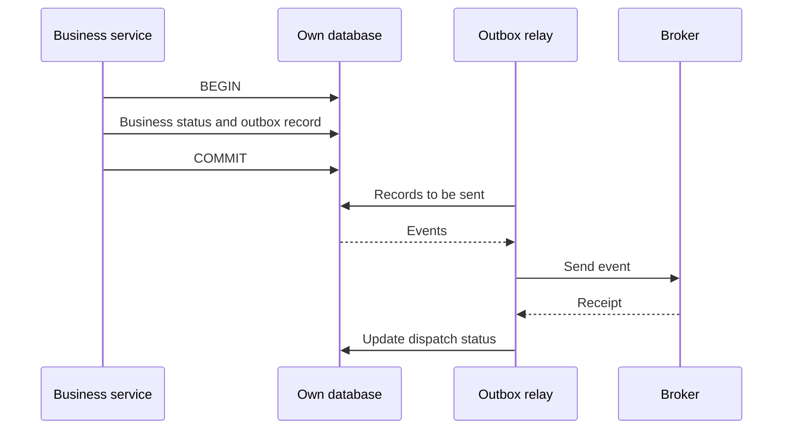

# 07.03. Transactional outbox, inbox, and atomic boundaries

A common problem is that a service saves data and sends an event. If the two steps are performed in separate systems, the process may fail between the two. The transactional outbox connects the business modification and the fact of the message to be sent within its own database.

## The dual-write problem

If we first save the order and then send the event, the event may be missing due to the failure after saving. If we send the event first and then save, the consumer may be informed of an order that has not been created. A try-catch block does not make the two systems a common transaction.

## Outbox

Business record and outbox record are saved in a single local transaction. A relay later reads the message to be sent and forwards it to the broker. Relay can be a query-based or changelog-related solution; the main guarantee is the atomic connection of the local save.

The relay may fail after the acknowledgment but before the status update. Because of this, the same event can be sent again. Outbox does not eliminate duplication; can be used together with an idempotent consumer.

## Multiple relays and ordering

Several relays must coordinate how they claim records, otherwise they can do the same work unnecessarily in parallel. It can be lease, lock or partition-based allocation. The solution must make it possible to pick up the job again after the worker fails.

Ordering requirements are handled separately. An entity's version 7 and 8 event can be sent by two relays in reverse order if the selection does not preserve the desired order. The existence of the outbox table in itself does not mean a global or per-entity order guarantee.

## Inbox at the receiver

The inbox records received messages or processed identifiers. The consumer can record that a message has been applied in the same transaction as the business update. A unique key also protects against concurrent duplicates. The broker is acknowledged afterward.

For an external API call, the inbox and local transaction cannot atomically include the remote effect by themselves. In this case, the idempotency key, status query or reconciliation of the external API is also required. The atomic boundary must be named at each step.

> [!important] The outbox closes a specific gap
> Your business data and the message to be sent can be saved together. It does not provide an automatic joint transaction for the entire process of the broker, consumer and external service provider.

## Operational consequences

The number and age of unsent records should be observed. The table may need cleanup, but preservation should not make debugging or replay impossible. An event that has been waiting for a long time represents a business delay that the system must make visible.

## Review questions

1. Which error process does outbox fix and which doesn't?
2. Where can duplication occur in the operation of the relay?
3. Why is it not enough to use an inbox for a bank debit applied exactly once?

Pattern description: [Transactional outbox](https://microservices.io/patterns/data/transactional-outbox.html).
