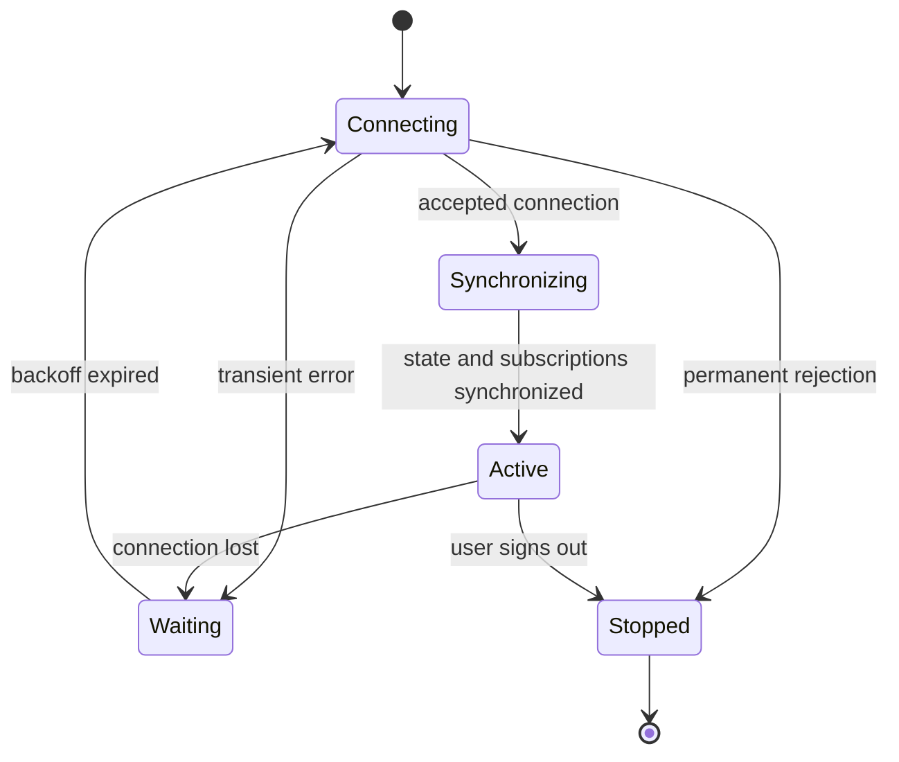

# 08.03. Heartbeats, reconnection, and state resynchronization

The persistent connection may be interrupted due to network switching, proxy timeout, server failure or client sleep. The client and server must jointly plan how to recognize the interruption and how to restore the application state.

## Heartbeat and time budget

With a heartbeat, one party expects a regular sign of liveness. Its timeout should match proxy idle timeouts, expected network latency, and client constraints. An overly short timeout causes unnecessary disconnections; an overly long one detects outages too late.

Background browser tabs and sleeping devices can delay timers. The server cannot assume every client runs on an exact schedule. An application heartbeat can check connection and processing liveness, but a pong does not prove that an earlier business command succeeded.

## Reconnect with backoff

Unbounded immediate reconnection by many clients can overload a restarting server. Exponential backoff and jitter scatter attempts. The wait should have an upper limit, and an uncorrectable authentication error should not be treated as a network retry.

The `Active` state does not start when the TCP connection is established, but after the necessary authentication and synchronization. This way, the client doesn't pretend to show fresh data while still using lagging state.

## Replay using an event ID

The client can retain the last applied event ID. When reconnecting, it asks to continue from this point. The server must provide a truly accessible and permission-filtered log. An arbitrary `lastId` field does not create persistent replayability.

If the retention time has expired or the resume point is unknown, the server may issue a resync signal. The client requests a fresh snapshot and then takes over the events from its version boundary. Otherwise, there may be a gap between the retrieval of the snapshot and the subscription.

## Snapshot and stream

If you first request a snapshot and then subscribe, missed changes may occur. If we first open a stream and then request a snapshot, the events and the snapshot must be combined. A common version or cursor makes it possible to decide which events are already included in the snapshot.

The client can recognize the repeated event by ID or version. For delta messages, the missing history may require re-reading. In case of a complete status message, a newer version may overwrite the older one. The two representations give different recovery rules.

> [!important] Reconnect restores a connection, not state
> Subscriptions, missed events and the result of in-progress commands should be sorted separately.

## Review questions

1. Why is it not enough to open a new socket after losing the connection?
2. How would you close the gap between snapshot and stream?
3. What state should the interface show during synchronization?
