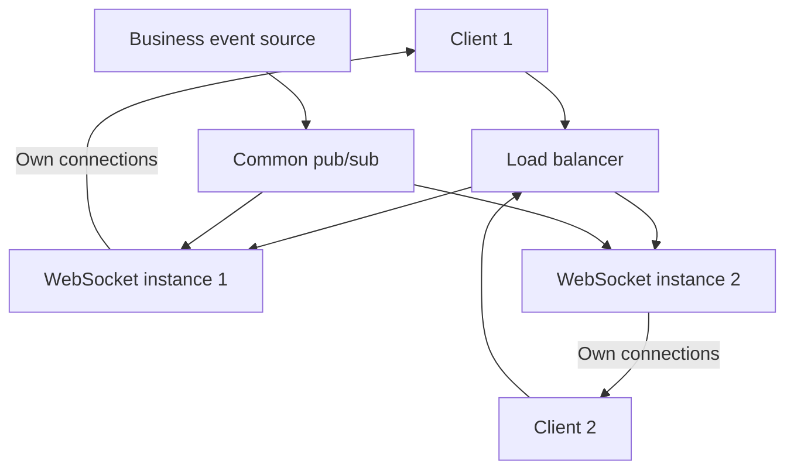

# 08.04. Scaling WebSocket and handling slow clients

A WebSocket connection is typically bound to a specific server instance during its lifetime. For multiple instances, the system therefore needs to know which event should be forwarded to which connection. Load balancing places a new connection; it does not move an already open connection to another process unnoticed.

## Local and shared state

The socket object and direct send buffer are in memory on the receiving instance. A user's identity, subscriptions, and a portion of the resume point may be persistent or shared. Sharing does not mean that another process uses the same socket object.

The figure shows a simple broadcast model. For many instances, channel or target-based distribution may be appropriate so that not all servers receive all events. The shared pub/sub is not necessarily a durable replay log either: we plan the two tasks separately.

## Sticky sessions and server failure

Sticky session may be necessary for certain multi-request or fallback transport solutions and may direct repeated connections to the same instance. An already open WebSocket will naturally remain on the target of the same connection. Stickiness is not a substitute for shared event distribution and resync after a server outage.

If the instance goes down, the client can connect to another instance. This should recheck the authorization and restore the subscription. The business state stored only in local memory can be lost, so persistent command results should not live exclusively in socket memory.

## Slow client and buffer

The server can generate events faster than the client can receive them. Increasing the buffer indefinitely may cause memory exhaustion. In addition to the connection count, unsent bytes, messages and the age of the oldest data are also important.

For current-state updates, several changes may be coalesced into the latest value. Important business events require a durable log and follow-up later. Dismantling a client that is too slow may be justified if the protocol clearly states how to recover. The browser's traditional WebSocket API does not provide an automatic, comprehensive receive-side backpressure.

## Draining and graceful shutdown

When stopped, the instance should not get a new connection. Existing connections can be closed within a bounded time or directed to another instance using a reconnect signal. Mass disconnection can cause a reconnect wave, so gradation and jitter are required.

Proxy configuration supports connection establishment and expected idle time. Intermediate buffering, short timeout and maximum number of connections can cause different errors. Capacity should be measured with real connection length, message size and slow client.

> [!tip] Don't just scale by connection count
> Message rate, fan-out, buffer and CPU processing also matter. Ten thousand quiet connections are a different load than a thousand active streams.

## Design exercise

There is a load balancer in front of three server instances, and each user receives events for their own orders. Plan for event forwarding, authorization filtering, server outages, and slow-client disconnections. Mark which state is local, shared and persistent.
