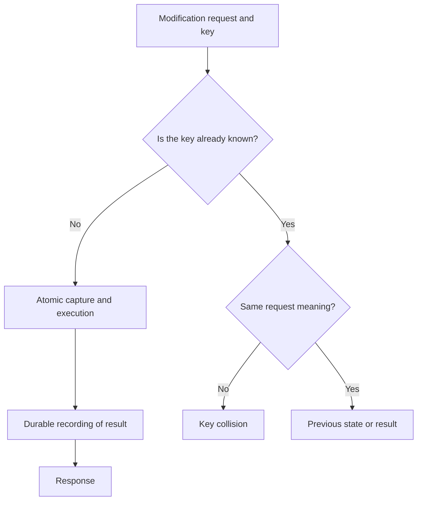

# 10.01. Timeouts, deadlines, retries, and idempotency

Fault tolerance plans bounded behavior under failure: how long to wait, when to retry, and how to preserve business correctness when the outcome is uncertain. An inter-service call should have explicit resource and time budgets.

## Timeout and full deadline

Timeout is the limit of a wait, such as a connection or read response. A deadline is the time by which the entire operation must finish. With an 800 ms client budget, each internal call cannot receive a fresh 800 ms: the chain would then exceed the promised deadline.

For sequential operations, work within the remaining time budget. This includes connection, processing and possible retry. If the client has already abandoned the request, the server may attempt to abort the unnecessary work, but the persistent effect is not reversed simply by terminating the connection.

## Which failures should be retried?

Temporary network failure or overload may improve later. Incorrect input, missing authorization and business rejection usually require a change. The automatic retry should only take place for the agreed error class, within the time budget and attempt limit.

The wait increases with exponential backoff; jitter reduces the simultaneous retry wave by random deviation. A possible illustrative rule is a random wait in the range `0` to `min(maxDelay, baseDelay × 2^attempt)`. The parameters are not chosen from a general recipe, but based on dependence and need.

## Idempotency key

For a change request, the client can use the same key for the same logical operation. The server durably stores the key, the meaning of the request and the result. When repeating, it does not perform the effect again, but gives the documented previous state.

The scope of the key matters: it can be tied to the user and the type of operation. Different payloads with the same key must be rejected or handled according to other explicit rules. Parallel first requests are protected by an atomic unique key or transaction state, not just a preliminary `SELECT`.

The “in progress” state must also be planned. A second request may wait, receive a pending state, or be routed to a status query. After the key expires, the same replay protection is no longer provided, so the retention period is part of the contract.

## Retry storm and single responsible layer

Independent retry of client, gateway, proxy and service multiplies the load. Choose which layer knows the meaning of the error and whether retrying is safe. Other layers should not launch hidden, unlimited attempts.

> [!warning] A new operation does not automatically follow after a timeout
> The previous request may have already been executed. A retry is safe if the operation's contract and identity management preserve the one-time business effect.

## Review questions

1. How would you divide 800 ms between three serial calls and a possible retry?
2. What should happen with a different input with the same key?
3. Why does key retention time matter for a days later replay?

Operational experiences: [Timeouts, retries and backoff with jitter](https://aws.amazon.com/builders-library/timeouts-retries-and-backoff-with-jitter/).
