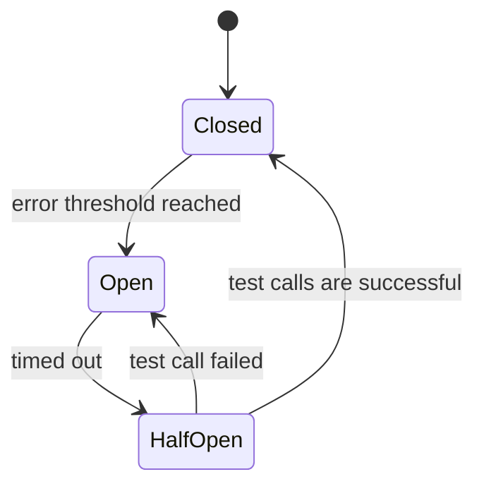

# 10.02. Circuit breakers, bulkheads, and overload protection

A failed or slow dependency affects more than one call. Waiting requests can occupy connections, memory, and worker slots, allowing failures to spread to other functions. Fault tolerance limits this propagation and supports recovery.

## Circuit breaker

The circuit breaker observes the result of calls to the dependency and temporarily interrupts new attempts in the event of a persistent error. Calls go through in the closed state. In the open state, the breaker quickly rejects. In the half-open state, a limited number of probe calls test whether the dependency has recovered.

The error threshold can be related to a time window and a minimum number of samples. A business rejection such as "out of stock" is not necessarily a dependency failure. If this is considered a technical error, the breaker can also disable a healthy service.

The breaker does not perform the operation later. Gives a quick rejection or planned fallback. A persistent work queue or other explicit continuation model is required for later execution of the important command.

## Bulkhead

With bulkheads, we separate the resource budgets. For example, an external report request cannot use all connections reserved for payment operations. A separate pool, concurrency limit or execution unit reduces the propagation of errors.

The price of isolation is resource usage and configuration. A limit that is too low may reject normal traffic; one that is too high provides little protection. The limits are chosen based on the load and delay profile, and then checked by measurement.

## Rate limits and concurrency limits

The rate limit limits accepted requests per time unit. The concurrency limit is the work in progress at the same time. In a slowing system, the same request rate per second results in more concurrent work, so the two limits address different problems.

A separate limit may be justified according to user, tenant, endpoint or external dependency. The choice should not allow a single client to occupy all capacity. In case of overload, a clear rejection, retry indication and an upper waiting limit are required.

## Degraded operation

Fallback can be cached data, partial response or omission of an optional function. The meaning of the result must be preserved. "The payment service is faulty, therefore we assume a successful payment" is an unacceptable fallback. "Ratings are temporarily unavailable", however, may be partially correct.

When displaying an outdated cache, the need for freshness counts. Yesterday's price, current stock and a non-critical statistic require a separate rule. Generic fallback is bad architectural shorthand for all endpoints.

> [!important] Fault tolerance = limited known behavior
> The system can be well designed even if it rejects a certain operation on error. A deceptive success response is worse than a traceable pending or failed state.

## Fault injection task

Design a test where a dependency slows down for two seconds, gives incorrect responses, and then becomes completely unavailable. Enter the expected timeout, breaker state, concurrency limit and client response. Measure whether the failure of the optional function affects the critical operation.
