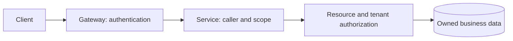

# 10.03. Service identity, TLS/mTLS, and authorization

It is also necessary to check between services who is calling, what they are entitled to, and what resource is affected. The internal network is not automatically trusted. A caller who is not allowed due to a faulty configuration, a compromised component or an accidental public route can also access the service.

## Connection security and identity

TLS provides an encrypted connection and certificate verification according to the agreed trust model. With mTLS, both parties can authenticate using certificates. This can establish service or workload identity, but does not determine which business operations the identified caller may perform.

Certificate management includes issuance, validity, rotation and root of trust. An expired or unknown certificate should not be "fixed" by turning off verification. The operational plan includes update and outage management.

## Service tokens and user context

A call can be a purely service operation or an operation performed on behalf of a user. The two must be distinguished. In addition to the service's own identification, user authorization and tenant context may also be required.

When forwarding a token, check its audience and scope. A token issued for a public frontend must not automatically be sent to every internal service unless those services are its intended audience. Delegation or purpose-specific service tokens may be used according to the identity system.

When using JWT, check the signature, allowed algorithm, issuer, recipient and time conditions. Payload decoding is not authentication. The key source and token type should come from a trusted configuration, not an arbitrary address provided by the attacker.

## Gateway and resource authorization

A gateway can authenticate callers and apply initial access rules. The service remains the data owner and decides whether the caller may modify a particular order. Being signed in does not grant access to every resource ID.

Compare the client-supplied tenant ID with the authenticated context. Cache, background work and event consumption should not lose this limit either. A wrong read model or cache can give sensitive data to another user.

## Least privilege

A service should access only the APIs and data it needs. The inventory reservation service does not need to write all customer databases. Together, API-scope and database privilege reduce the impact of a compromised component.

Do not include tokens, passwords or sensitive payloads in the logs. For diagnostics, an identifier, operation name, output and a securely selected context are usually enough. The trace identifier is monitoring data, not proof of authorization.

> [!warning] Internal availability is not an access permission
> Network restriction, authentication, and business authorization are complementary boundaries. Neither automatically replaces the other.

## Review questions

1. What does mTLS prove and not decide?
2. Why does the service have to check the owner of the specific order also behind the gateway?
3. What error can a shared cache without a tenant context cause?

Token Validation Guidelines: [RFC 8725 — JWT Best Current Practices](https://www.rfc-editor.org/rfc/rfc8725.html).
