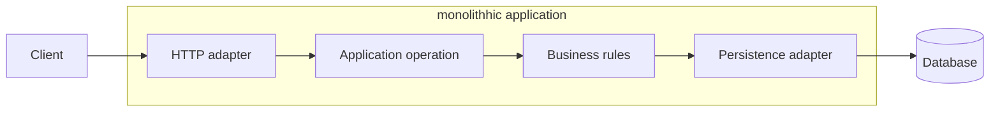

# The monolith: a simple boundary with an intricate internal structure

A monolith is an application whose main business functions belong to one deployment unit. This does not imply disorganized code. A monolith can have a layered, component-based, or modular internal architecture; its defining characteristic is the shared release and runtime boundary.

## A request's path through a monolith

A web adapter receives an HTTP request, the application layer starts the operation, the domain layer applies business rules, and a persistence adapter saves the result. Communication between these parts usually consists of local calls. Control flow, exceptions, and transaction context can be followed within one process.

Layers are not services. Putting the domain layer in a separate file or package does not introduce a network boundary. The cost and failure modes of function calls differ fundamentally from those of a remote API call.

## Why is it useful?

A developer starts one application, the debugger sees one call stack, and the release pipeline produces one artifact. A business operation can update several tables in a local database transaction. Calls between components do not require network contracts, discovery, timeouts, or remote identities.

This is a substantial advantage for a small team with rapidly changing product boundaries. Responsibilities that are still uncertain are cheaper to reorganize within a process than across services and data owners. When a field's meaning changes, its users can be updated in one release.

A monolith can also scale horizontally: multiple instances can receive requests behind a load balancer. Session handling and persistent state must be designed accordingly. A monolith therefore does not mean “runs on one server.”

## Where do the costs appear?

Release risk and process resources are shared. A memory leak can affect other functions. If only image processing needs more CPU, additional instances of the whole application may be necessary unless processing has been organized into a separately runnable unit.

In a larger organization, shared code and pipelines can become coordination points. Long test runs, a large regression surface, and frequent conflicts can slow change. These problems do not follow solely from being a monolith: weak module boundaries and neglected tests can also cause them.

## When should we keep it?

A monolith can be a good choice when the application's main parts change together, need shared transactions, and the team can manage one release efficiently. Architectural progress is not measured by service count. First identify the specific problem that cannot be solved by improving the internal structure.

> [!warning] “monolithh” is not a diagnosis
> Circular dependencies, unrestricted table access, and enormous classes are design problems. Moving them into separate processes does not fix them by itself.

## Analysis exercise

A four-person team releases an application twice a day. Catalog and order management work reliably, but image processing consumes the CPU. Suggest three solutions, and distinguish the resource-isolation problem from converting the entire system to microservices.
