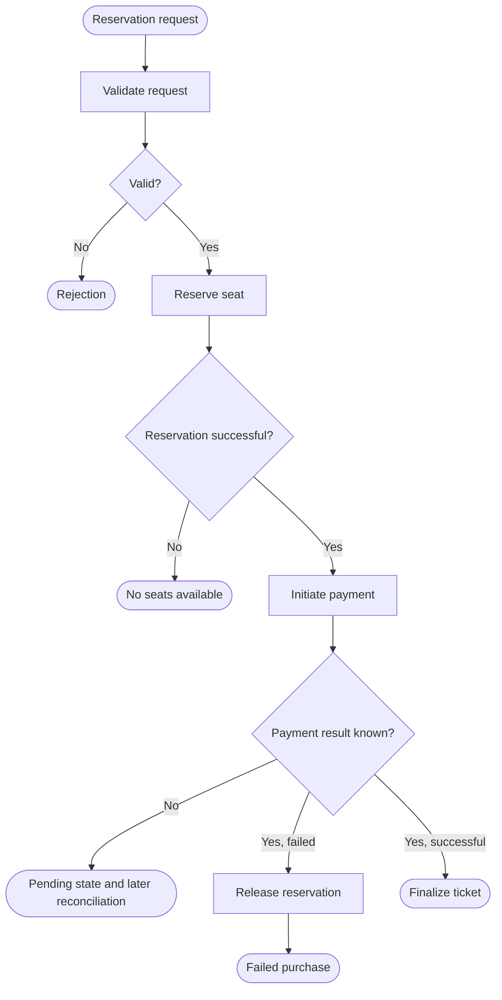

# Flowcharts, decisions, and parallel steps

The flowchart shows the execution steps and the control relationship between them. It is useful when the question is under what conditions what happens. An architecture diagram names the components; a flowchart describes the possible paths of an operation.

## Building a process

Let's start with the launch event and then list the important steps. The decision point is formulated as a question, and the outgoing branches are labeled with conditions. The process should have an interpretable end: success, rejection, waiting or human intervention.

The figure treats failed payment and unknown result separately. The timeout does not mean that the service provider has not charged the card. "No response" is not the same decision criterion as "refused".

## Activity and responsibility

In addition to the process, the activity diagram can also indicate responsibility swimlanes and parallelism. The lanes show which actor or component performs the action. Mermaid `flowchart` and `subgraph` can be used to create a view like this, but the generic arrows do not automatically carry all the rules of UML activity notation.

When drawing parallel steps, specify the join condition. If two checks start at the same time, are we waiting for the results of both? Is the first success enough? Does the first error break the second? A bifurcated arrow alone does not answer this question.

## Failure branches and retries

The error branch is named according to the meaning of the operation. The validation error should not be repeated, the temporary network error may be. If retry loops are included, have an upper limit and an exit condition. The "error → retry" infinite arrow without an action rule is an incomplete plan.

Compensation is a separate operation. Releasing a reservation is not necessarily a matter of running the previous code backwards, and it can fail itself. The flow diagram may therefore show a status pending recovery. This is not a question of detail: it tells you who and how to continue the interrupted operation.

> [!warning] The drawn arrow is not a guarantee of execution
> In addition to the description of the process, the persistent state, repeatability and error handling must be specified. The figure does not make the multi-service process atomic.

## Creating Mermaid diagrams step by step

Use short stable node IDs like `A`, `Validate`, `Reserve`. Write the caption separately, in quotation marks, so that the accented text and punctuation marks are clear. The direction `TD` is from top to bottom, `LR` is from left to right. Break a long process into several views rather than keeping all the small implementation steps on a single page.

The source should be version-controlled text, and the figure should always be updated with the surrounding explanation. For exact grammar: [Mermaid flowchart](https://mermaid.js.org/syntax/flowchart.html).

## Analysis exercise

Draw a flowchart of receiving a webhook: signature check, duplication check, persistent save, processing and acknowledgment. Mark after which error a retransmission is expected, and what protects the system from double processing.
