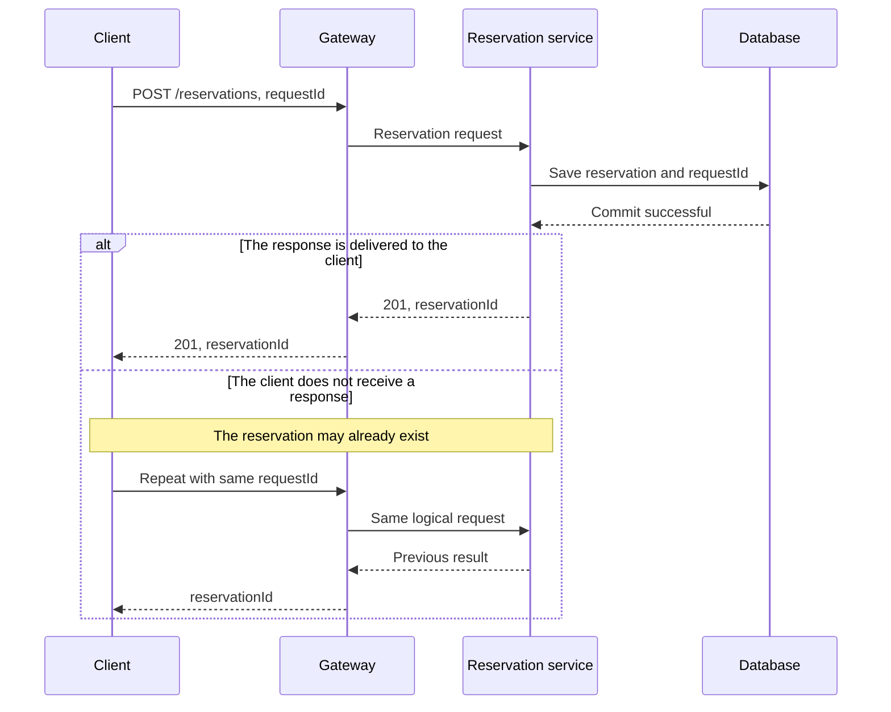
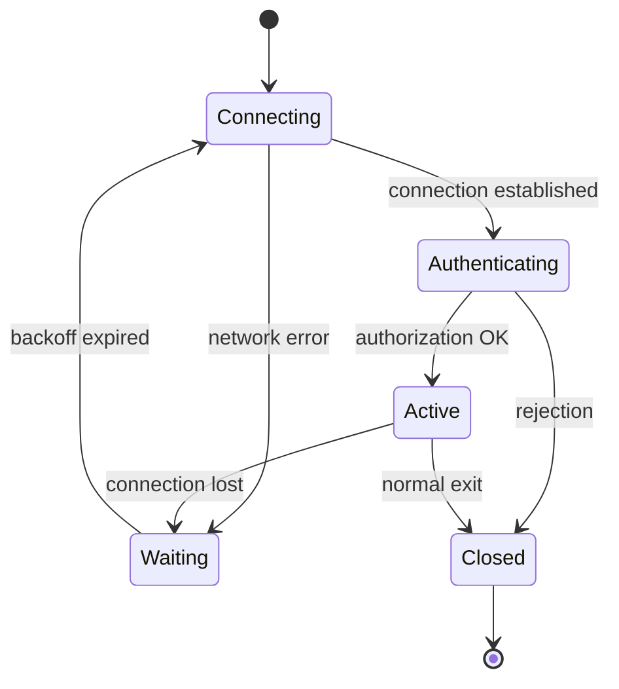

# Sequence and state diagrams

The sequence diagram shows the messages of the collaborating participants in chronological order. A state diagram describes the possible states and transitions of a single element. The two complement each other: one explains who communicates with whom, the other explains what state change this causes.

## Sequence diagram: participants and messages

The vertical lines are the lifelines of the participants. Time moves from top to bottom. The participant can be a browser, service, broker or database, but we should preferably show the same level of responsibilities in a diagram. We label the message with an action and important information.

`alt` indicates alternative routes, `opt` an optional step, `loop` a repeat, `par` a parallel section. For an asynchronous message, explain separately who acknowledges the reception and who reports the result of the actual processing. A response arrow does not always indicate business success.

The chart shows a time sequence, but not an exact time scale. The distance between two arrows does not automatically mean a 20 ms delay. If you analyze a time budget, write the measured or assumed times next to it.

## State diagram: lifecycle rules

A connection is not simply “present” or “absent”. It can be created, wait for authentication, be active, be aborted, and then resync. The state diagram shows the transitions that are allowed.

Name the data associated with each state. A `Pending` payment needs an operation ID, a start time, and a reconciliation deadline. An `Active` connection may hold a subscription set and the last processed event ID. A state name alone is insufficient to define behavior.

## Invariants and missing transitions

An invariant is a rule that is true in all allowed states. For example, a new seat cannot be added to a closed reservation. The action should be checked by the service, not just hide the interface button.

Let's check the late messages as well. What happens if the reservation has already expired, but you receive a notification about the success of the payment later? The missing transition does not mean that such a message cannot be received in reality. Rejection, refund or reconciliation required.

> [!important] Check the same process in two views
> For all important sequence messages, assign a status change or give a reason for not changing status. Thus, the error "we answered but did not save" and "we saved but there is no recovery path" can be noticed.

## Design exercise

Create a state diagram of an export job with states `Queued`, `Running`, `Completed`, `Failed`, and `Cancelled`. Use a sequence diagram to show creation, the worker claiming the job, and the result query. Clarify the transition after the worker fails.
