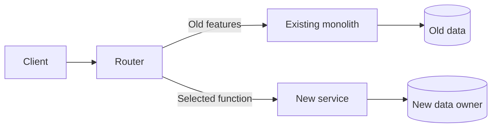

# Comparing designs and evolving a system incrementally

The diagram helps in the decision if the consequences of the alternatives are also visible. A nice microservice diagram does not prove that the application will perform better. We examine the plan with specific changes, load and error processes.

## One requirement, several designs

A catalog and order management can be implemented in three ways. In monolith, there is a joint release and a local call. Responsibilities are separated by narrow internal interfaces in modulith. For separate services, network APIs and independent data owners appear.

Use identical questions for comparison. Who modifies the product data? How is the purchase price included in the order? What happens if the catalog is not available? Which change requires two releases? Where do we check compatibility? If you list only the advantages of one plan and only the flaws of the other, there is no real comparison.

## Documenting an architecture decision

The ADR, i.e. architecture decision record, records the rationale for a specific decision. Usable structure:

- **Situation:** what requirement and limit do we decide on?
- **Alternatives:** which solutions did we examine?
- **Decision:** what did we choose and within what limits?
- **Consequences:** what do we gain, what do we undertake, what must be checked?
- **Revision:** what change can justify a new decision?

For example, we organize search into a separate service because it uses its own index, has a different load profile, and an acceptable short delay after catalog changes. As a consequence, you need to plan for index updates, handling stale hits, and rebuilding. This is a much more concrete justification than the statement "microservices are scalable".

## Strangler pattern

During a gradual conversion, the new operation is added to the old one. A router or proxy directs certain routes to the new service, and the rest is handled by the old application. The responsibility of the old system is reduced step by step.

Changing the routing is only the visible step. The transfer of the data owner, ongoing operations and old consumers must also be handled. During migration, it is especially dangerous to create two independent writers for the same business state.

## Anti-corruption layer

When the new model communicates with the old system, an adapter can translate the old concepts into the language of the new context. This anti-corruption layer prevents the limitations of the old data model from seeping into each new component. The adapter is not just field renaming: it also handles difference in meaning and errors.

## Checking the design

Read through the diagram with one successful, one unsuccessful and one repeated action. Check which service owns the data for every modification. Look for circular calls, hidden shared tables, and too long synchronous chain. Ask for each new box: what is the reason for the separate lifecycle?

> [!tip] Let the plan and the decision live together
> The diagram shows the structure; ADR explains why. When changing, update both, otherwise the drawing will lose its justification.

## Review questions

1. Why is it not enough to route to the new service when selecting a feature?
2. What should be the rollback criterion for a transfer of data ownership?
3. Formulate ADR on search service selection and add a measurable review criterion.
