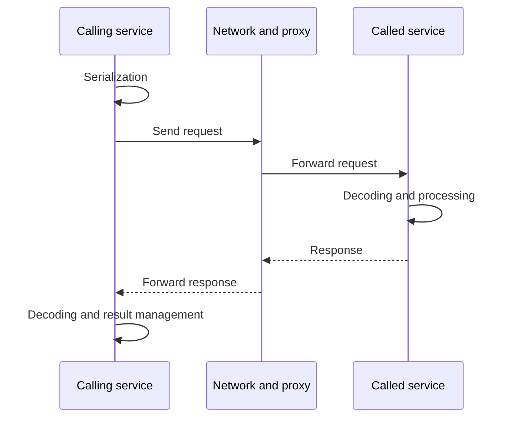

# A remote call is not a local function call

In a local function call, the caller and callee work in the control and memory environment of the same process. When making a remote call, the request and response travel as messages. The receiver may be running in another process, on another machine, or in another network zone. The network boundary creates new costs and new uncertainty.

## The path of the message

The caller assembles the request, serializes the data, finds or opens a connection, and then sends the message. The receiver decodes, verifies and executes the operation. The response travels back through some of the same steps in reverse order. Business processing is only part of the total time.

A local object reference cannot be passed unchanged. The message contains only the agreed representation. The date, amount of money, optional field and error must also be coded clearly. The meaning of the serialized data is given by the contract, not by the object model of the client language.

## Four important outcomes

The caller may see a successful result, a business rejection, a technical error, or an unknown result. Technical error and business refusal may justify a different action. An "out of stock" response will not be corrected by automatically repeating the same request.

An unknown result may occur if the server made a change but the response was lost. Timeout only shows that the caller has timed out. It does not prove that the operation was not executed. To repeat a modification operation, therefore, a logical operation identifier or queryable state is required.

## Partial failure

In a distributed system, one part can work while the other is unavailable. The network, DNS, a proxy, or just one of the service instances may be faulty. Slow response and failure can look the same to the caller for a long time.

There is not necessarily an observation from which the caller can immediately determine what happened on the remote side. The plan must address this uncertainty. This is the most important difference from a local method call: the seemingly simple syntax of a remote operation does not remove the network boundary.

> [!warning] A generated client does not make the call local
> A gRPC stub or SDK can expose the API as a convenient function call. Timeout, contract version, and partial failure are still part of how the system works.

## Diagnostic data

For a service call, the logical operation ID, trace ID, target service, time budget, and output are useful. The operation identifier supports retry handling; the trace identifier supports tracing the call chain. The two are not the same, and a retry can create multiple network attempts for the same business operation.

## Review questions

1. Why can remote modification succeed with timeout?
2. What data must be saved so that the result can be clarified later?
3. What problem does it cause if an API publishes the entire structure of internal objects?
