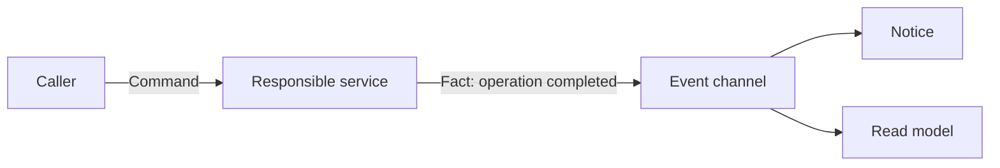

# Request–response, messages, events, and streams

The communication model describes the cooperation of the participants. The transport tells how the data is delivered; the application contract is what the message means. REST API, RPC and event stream can also work on the same HTTP connection. The designations are therefore used on a separate level.

## Request-Response

The caller is requesting the result of a specific operation. The response can be an immediate result or the identifier of a task that will be completed later. In synchronous use, the caller waits before proceeding. This gives simple tracking, but the callee's availability and latency become part of the caller's route.

Waiting does not necessarily block an OS thread. Even with asynchronous I/O, the logical dependency remains: the business operation can only be continued after the response. The language keyword `async` is therefore not the same as event-driven communication between services.

## Command and event

The **command** expresses an intent: "reserve two seats". Its recipient is responsible for execution and can reject it. **Event** reports the fact that "two seats have been reserved". The consumer can start another business process from it, but the event is not treated as an execution instruction addressed to that consumer.

The distinction affects both contract and error handling. For a command, we need to know the result of the operation or the place to query the result. In the case of an event, it must be clarified which consumers modify which own state.

## Asynchronous messaging

Sender and receiver execution can be separated in time. The broker can receive the message even when the consumer is temporarily not running. This may reduce the direct availability dependency, but introduces new states: pending, in-progress, processed, and error messages.

Message acknowledgment is not the same as business processing. The producer's broker acknowledgment and the consumer's processing acknowledgment are separate events. It must also be made visible to the user if the result is still pending.

## Streaming

A stream transmits multiple data or messages in a logical flow. It can be server to client, client to server or bi-directional. In a telemetry stream, each item can be an event; a file download stream, on the other hand, is a sequence of bytes. Streaming is not automatically an event-driven business architecture.

A long-lived stream needs rules for interruption, slow receivers, buffering, and the resume point. If the consumer is receiving data faster than it can process it, simply keeping the connection alive will not save memory.

> [!important] Three separate questions
> What does interaction mean? Which transport carries it? What time dependence is there between the participants? Response these separately, for example: command, HTTP, result that can be queried later.

## Selection exercise

Select a model to request a price, create an invoice and transmit live instrument data. For each, name the result, the waiting behavior, and how processing resumes after an interruption. Explain in which case the persistent message is important and in which case the current state.
