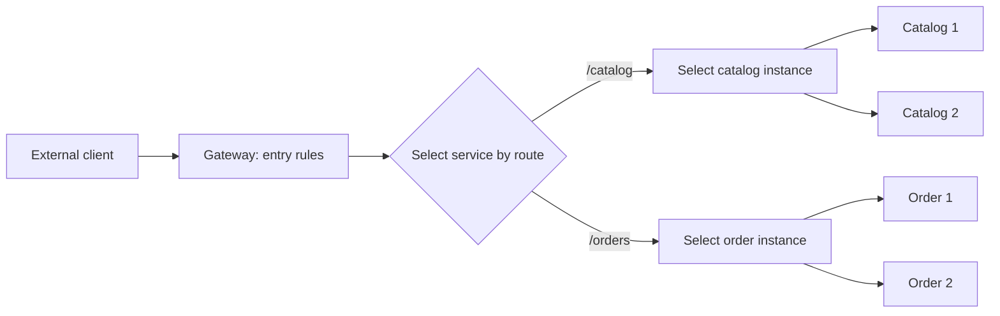

# Service routers, reverse proxies, load balancers, and gateways

For multiple services, the client must somehow get to the correct instance of the correct service. Routing decides which destination should handle the request. Load balancing chooses between available instances of the target service. The gateway can also perform shared entry-point and API-management tasks.

## Distinguishing the roles

**reverse proxy** stands in front of the servers and forwards incoming requests. It can hide internal addresses, terminate TLS and manage multiple upstream targets. **load balancer** distributes traffic between instances. We can use the name **service router** for the role that selects a logical service based on the request. The term does not mean a separate, standard component on all platforms.

**API gateway** is the entry point for APIs. In addition to routing, you can perform authentication, load limiting, API versioning, and monitoring tasks, for example. A product can perform several of these roles at the same time. In the architecture, we name the function, do not assume that a separate server must be started for each concept.

## Routing considerations

The target can be selected by host, such as `catalog.example.test`, by path, such as `/catalog`, or by an explicit version indication. The router must apply the rules in a clear order. A wildcard that is too general can swallow a specific route.

When rewriting routes, we clarify what the internal service sees. If the gateway cuts off the `/catalog` prefix, the internal server accepts a different route than the public API. The redirect and the `Location` header, on the other hand, must contain an address that can be interpreted by the client.

The headers forwarded by the gateway are trust issues. The "user" or "role" header specified by the external client cannot automatically become an authentic user context. The entry point must separate the reliably generated data from the data sent by the client.

## The benefit and cost of a common entry point

The client needs to know fewer service addresses and authentication connections. The internal decomposition may change in addition to a stable public API. Common rules can be enforced and traffic can be measured uniformly.

At the same time, the gateway adds an extra hop, a shared dependency and configuration risk. It requires its own capacity, high availability and fault management. If all business processes move to the aggregator, a new monolithic coordinator may emerge in front of the services.

> [!important] The gateway does not take over data ownership
> The entry point can verify the request and the authentication, but the business invariant and the authorization for the resource must also be validated by the responsible service.

## Design exercise

Design routing for Catalog, Order and Notification API. Enter the public route, the internal destination name, the rewrite and the error response in case of an unknown route. Mark which task is routing, which is instance selection, and which is an API-level rule.
