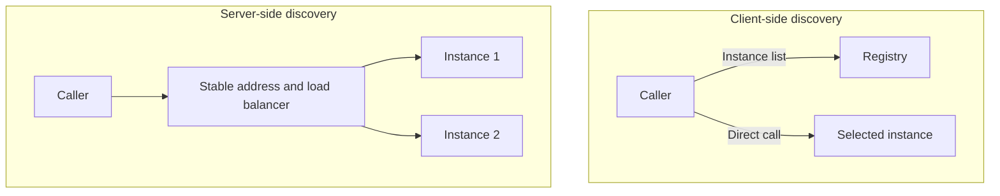

# Service discovery and load balancing

A service's logical name can be stable while its instances start, stop, and move to another address. Service discovery solves the problem of how to find the currently usable target. The client should not rely on manually entered IP addresses that are assumed to be valid forever.

## Client-side and server-side discovery

In the case of client-side discovery, the caller receives information about the available instances and chooses among them. This requires registry or DNS information, a client-side cache and a load balancing rule. The advantage may be fewer intermediate jumps, the cost is the complexity appearing in the clients.

In the case of server-side discovery, the client calls a stable address, an intermediate component selects an instance. Clients are simpler, but the availability and freshness of the middle layer is important. A common platform solution is a stable service name and a changing set of endpoints behind it.

## The list is not completely up to date

Registry, DNS cache and health check status may be delayed. An instance may drop right after the client sees it as healthy. Discovery is therefore not a substitute for timeout and error handling per call.

An overly long cache lifetime can delay removal of failed addresses. A cache time that is too short can burden the discovery layer. The settings should be chosen based on the instance lifecycle and platform operation. Due to the reuse of the connection, the client can connect to an old instance even after the DNS update.

## Load-balancing algorithms

Round robin selects in order between instances. In a weighted version, a different capacity or gradual introduction can be reflected. Least connections or a similar load-sensitive rule looks for the least busy instance. The exact measure matters: an open WebSocket and a short HTTP request are not the same resource demand.

Hash-based distribution can assign a more consistent target to a key. This is useful for cache locality or partitioned state, but redistribution may occur when an instance changes. Sticky session directs further requests from a client to the same instance; this may simplify the local state, but it may worsen the uniform distribution and does not solve the failure.

## Health, readiness, and draining

A process may be alive without receiving traffic yet. Readiness indicates this receptiveness. Liveness can answer another question about the functionality of the process. If the transient failure of each external dependency is considered as a restart cause, an unstable restart wave may develop.

When exiting, the instance should first not receive new requests, then finish the current ones in a limited time budget. For long connections, a separate disconnection and reconnection procedure is required. The order of discovery update and disconnection affects users.

> [!warning] A successful health check does not guarantee the success of the next request
> The path between the caller and the target may fail and the instance state may change. The health check is an input to routing, not a guarantee of business execution.

## Review questions

1. Why is it not enough to publish a new DNS address if there are long connections?
2. What distribution problem can there be with sticky session?
3. What should be the order of traffic exit for an instance running a long export?

Solution for a specific platform: [Kubernetes Service](https://kubernetes.io/docs/concepts/services-networking/service/).
