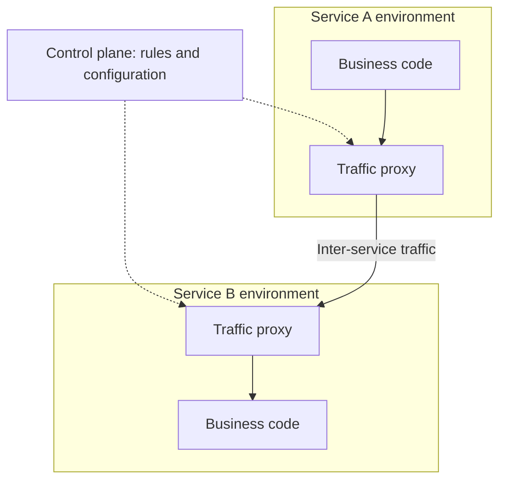

# Service meshes and the limits of intermediaries

A repetitive infrastructure task for many services is the management of address resolution, encrypted connection, routing, metrics and certain fault tolerance rules. The service mesh places some of these in the traffic layer between services. It is not a business architecture style, but a cross-service infrastructure.

## Data plane and control plane

The data plane handles the actual traffic: proxies or other data path components forward the requests. The control plane provides configuration and rules for the data plane. The implementation can be sidecar-based or have a different structure; the distinction of roles is more important than the topology of a single product.

Mesh can help with common connection security and traffic measurement. However, the business meaning of the operation is not automatically known. It cannot determine whether retrying a payment request after a timeout is safe.

## The relationship between gateway and mesh

The gateway typically stands at the boundary of the system, the mesh is connected to internal service traffic. The roles may overlap but serve different purposes. In a small system, the gateway and platform service names may be sufficient; it is not mandatory to introduce mesh alongside microservices.

Each intermediate layer brings a new configuration and diagnostic interface. The request error can be caused by the business service, proxy, routing, or certificate. The developer needs to know which component responded and where the time budget expired.

## Retry and timeout in multiple layers

If the client tries three times, the gateway forwards each attempt three times, and the mesh again three times, there can be up to 27 remote attempts from one logical operation. This is an illustrative maximum: the exact behavior depends on the configuration. The point is that individual retries of the layers can multiply.

It must be planned in one place, who is entitled to repeat, under what conditions and for how long. Propagate the deadline through the call chain and limit the retry budget. The infrastructure-level default cannot override the application idempotency condition.

## Routing as risk

An incorrect route can make an entire service unavailable. Selecting the wrong version can route the client to an incompatible server. An internal endpoint accidentally made public breaks a security boundary. The routing configuration is therefore part of the working contract, not just an operational detail.

> [!warning] Infrastructure does not fix poor decomposition
> Mesh can encrypt and measure a chatty circular call chain. This does not eliminate chain coupling and business errors.

## When is it justified?

The number of shared traffic rules, the size of services and teams, and the ability to operate together can justify a mesh. Before the introduction, it must be named which recurring problem it solves and how the extra layer can be diagnosed. In a small system, more infrastructure is easily more cost than profit.

## Review questions

1. Which task can a proxy perform and which should be decided by the business service?
2. Where would you set retry on a three-layer call path?
3. How would you separate the service error from the routing error?

Specific proxy architecture: [What is Envoy](https://www.envoyproxy.io/docs/envoy/latest/intro/what_is_envoy).
