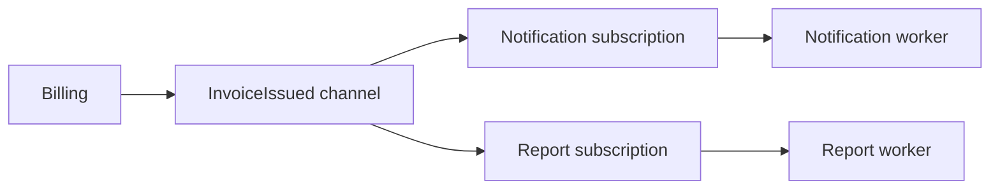

# Queues, publish–subscribe, and event logs

In an asynchronous service connection, the sender issues the message, and the consumer processes it later. A broker or other message intermediary may be between them. The meaning of the communication is given by the sent command or event, and the infrastructure organizes the transmission, storage and delivery.

## Work queue

Behind a queue, several workers can compete for processing the same jobs. An export task should usually be performed by one worker, not all of them. The work queue distributes the load and can buffer transient traffic spikes.

Queue does not increase capacity infinitely. If 100 tasks are continuously received per second, but only 80 are completed, the pending work keeps growing. In addition to the queue length, the age of the oldest message is also important: it shows the delay perceived by the user.

## Publish–subscribe

In the pub/sub model, one fact can be received by several independent consumers. The `InvoiceIssued` event is handled differently by notification, report, and accounting integration. Each consumer produces results within its own area of responsibility.

Each consumer or subscription needs its own processing position. If three instances of the notification worker are running for the same subscription, they typically share the notification work; the reporting subscription receives the same fact independently.

## Durable log and consumer group

In event log, the records are kept for a while, and the consumer tracks its own position. The data can be read again as long as the retention rule allows. In a consumer group, members can share the processing of partitions; separate groups can travel independently on the same stream.

The difference between queue and log should not be interpreted based on a single product name. Delivery model, retention, position management and replay are important. An infrastructure can support multiple patterns with different configurations.

## Event contract

An event should have a stable type, identifier, schema version, and business meaning. The timestamp can describe when the fact occurred, but it does not guarantee a global order. The data owner should not automatically send the entire internal table every time there is a change.

The fact may contain enough data for the consumer or only an identifier that needs to be queried later. The first solution brings more data and schema, the second can bring back a synchronous dependency. The choice depends on the requirements of freshness, data protection and availability.

> [!important] An event is not a public copy of the internal database
> The public event is a contract of cooperation. Don't bind the consumer to implementation details that the producer wants to change independently.

## Design exercise

Choose a model for three cases: processing images, notification of invoice issuance to several systems, reconstruction of search index from previous changes. For each, name who receives the data, how long it must be kept, and what happens when a consumer fails.
