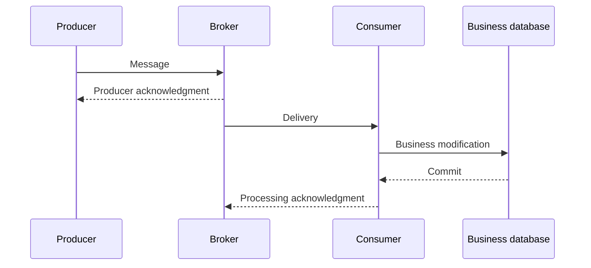

# Acknowledgments, delivery guarantees, and duplication

The reliability of messaging must be interpreted along the entire path: producer, broker, consumer and business data store. A "reliable broker" does not automatically mean that a business impact will occur exactly once.

## Two separate acknowledgments

A publisher confirm or similar producer-side acknowledgment indicates that the broker has received the message according to its application contract. The consumer acknowledgment is related to the processing of the consumer. The durability and replication meaning of the acknowledgment depends on the product and configuration.

If the consumer stops after the commit but before the acknowledgment, the broker can resend the message. The effect has already taken place, yet the same work arrives again. If the consumer acknowledges before the commit, the work may be lost when it crashes. The acknowledgment order is therefore part of the durability plan.

## At-most-once and at-least-once

In the At-most-once model, we do not redeliver in a way that could cause duplication, but the message may be lost. This may be appropriate for rapidly aging telemetry, where the next state overrides the significance of the previous one.

In the at-least-once model, delivery may be repeated until it succeeds under the agreed conditions. The consumer should expect duplication. For durable business commands, this is a common choice when idempotent processing is associated with it.

Always identify the boundary of an “exactly once” guarantee. A broker or stream processor can provide such a feature in a defined transactional scope, but the effect of an external e-mail, banking API or other database does not automatically become exactly one-time. End-to-end business impact requires a separate plan.

## Idempotent consumer

The consumer can durably record the processed event ID with the business modification in a transaction. On redelivery, it recognizes that the effect has already taken place based on the unique identifier. Checking and saving should not be two independent steps, because two workers can both see the same message as “new” at the same time.

Deduplication duration is related to replay and retransmission time window. If processed identifiers are deleted too soon, a late retry may appear as a new operation. The original payload or its fingerprint can also be associated with the identifier, so that different content with the same key does not run silently.

> [!warning] The acknowledgment does not mean the same thing to everyone
> "Received", "durably stored" and "executed as a business operation" are separate statements. Separate them both in the protocol and in the user state.

## Review questions

1. Why can I receive a repeated message after a successful database commit?
2. Where should the deduplication record transaction boundary be?
3. Why doesn't a broker's exactly-once function prove an email sent exactly once?

Specific acknowledgment model: [RabbitMQ confirms and acknowledgments](https://www.rabbitmq.com/docs/confirms).
