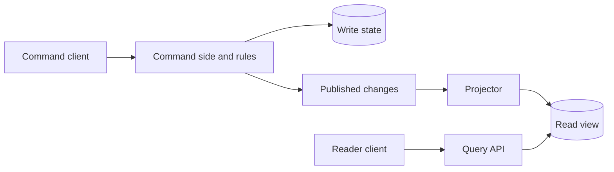

# Read models, CQRS, caching, and replay

Not only request-time API composition can be used to read the data of several services together. A separate read view can collect the necessary data in advance. The write-side data owners are still independent, and the read model maintains a copy optimized for the consumer's needs.

## Materialized view

Displaying an order list may require an order amount, payment status, and shipping estimate. You can update this combo view from read model events. The reader queries a single data source with fewer synchronous dependencies.

The view can lag behind. The interface should distinguish an “in progress” state from a final error. A source version, update time, or explicit pending indicator can help users make decisions.

## CQRS

CQRS separates the command-side model from the query-side model. Writes follow business invariants, while reads follow display and query requirements. This can be implemented inside a monolith and does not require microservices.

CQRS is not the same as event sourcing. In event sourcing, the persistent business event sequence is the main state source from which the current state can be generated. In addition to a traditional state store, a read model updated from events and a CQRS-based separation are also possible.

The projector applies events to the view. It should be idempotent and handle duplicates, delays, and contract changes. A read-view error must not silently modify authoritative write-side state.

## Rebuild and replay

If the view is discardable and source data or event retention is sufficient, it can be rebuilt. The plan should tell you what the build will start from, how it will handle new changes, and when the client can be switched to the new view.

Replay may not always perform all original side effects. Reprocessing an old `InvoiceIssued` event can be used to update the read model, but it should not automatically send an email again. Separate the purpose of the projector and business reactions.

## Cache and invalidation

The cache reduces the cost of retrieval, but the update rule must be defined. With TTL, data expires over time; event-based invalidation may follow the modification more quickly, but the event itself may be delayed. The two solutions can be combined.

After the invalidation event, a slow, previously started request may write old data back into the cache. Version control or a conscious loading rule may be required. The "delete the key after every modification" solution is not enough for every race condition.

> [!warning] The freshness of the copy is part of the contract
> The client needs to know when to consider a view as a decision base. The benefit of the read model does not entitle you to a promise of consistency that it does not provide.

## Design exercise

Draw a read model for a customer's order summary. Provide the sources, event ID, version control, and rebuild progress. Separate the data from which we provide information and the operations that require the decision of the original data owner.
