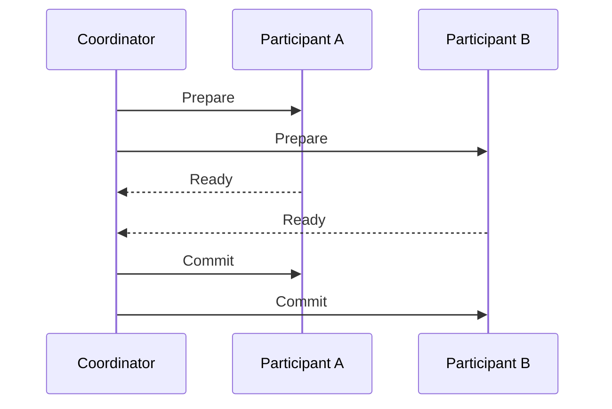

# Distributed transactions, isolation, and business boundaries

Atomicity and isolation of operations involving multiple services must be analyzed separately. The statement "We use ACID databases" refers to the local transactions of each database. It does not automatically cover the commit of the other service or an external API call.

## Two-phase commit

The two-phase commit, or 2PC for short, coordinates the joint commit of the participants with a coordinator. First, the participants prepare the transaction and indicate whether they are ready. The coordinator then announces a commit or rollback decision.

The solution can only be used with participants that support the appropriate protocol and transaction capability. An arbitrary HTTP endpoint does not become a 2PC participant by the coordinator sending it two requests.

A prepared transaction can hold resources. In the event of a coordinator or network error, an uncertain state and waiting may occur. Recovery, timeout and logging are part of how the protocol works. In exchange for a common commit, a stronger runtime and infrastructure dependency appears.

## Saga and isolation

For Saga, local transactions have already committed when the next step starts. Another operation can see the intermediate state. For example, a reservation keeps inventory in a "pending payment" state; another buyer can no longer take it away, even though the whole process is not yet final.

The intermediate state requires an explicit rule. You can use a temporary reservation with an expiration date, a status-based operation permission, or a version control. These help with business isolation, but are not quite the same as isolating a common database transaction.

## Competing operations

Two concurrent sagas may request reservations from the same stock at the same time. The inventory owner must make an atomic decision on the spot. If both callers separately consider the reservation "successful" based on an earlier availability copy, overbooking may occur.

Similar problem when compensation arrives late. The release can only affect the corresponding specific reservation, you cannot blindly restore the entire quantity of the product. The operation ID and status check prevent an old compensation from corrupting a new booking.

## Rethinking the boundary

If two sets of data require an immediate, common invariant in every operation, it is worth investigating whether they really should belong to a separate data owner. Poor decomposition cannot always be fixed with more infrastructure. A modular monolith or larger, cohesive service may be simpler and more correct.

However, the reason for the separate service may be a regulatory or organizational requirement. In such cases, we undertake the process state and reconciliation, and tell you exactly what is guaranteed. The technology choice cannot silently rewrite the business expectation.

> [!important] Atomicity and isolation are two issues
> By eventually compensating a faulty process, the intermediate state could already be seen by other operations. Their effect must be treated separately.

## Comparison exercise

Investigate inventory booking with a local transaction, 2PC and saga. For each, describe the participants, the resource wait, the intermediate state, and the failure recovery. Explain which solution would be acceptable under which requirement.

Operation of a specific prepared transaction: [PostgreSQL PREPARE TRANSACTION](https://www.postgresql.org/docs/current/sql-prepare-transaction.html).
