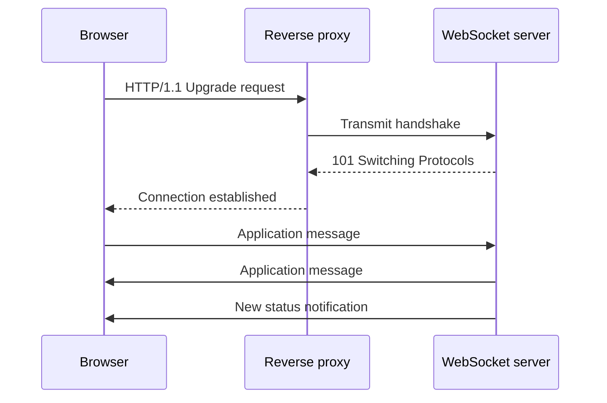

# WebSocket: connection establishment and bidirectional messages

WebSocket provides persistent, two-way message communication between client and server. After establishing a connection, both parties can send data without requiring a new client request for each server message. This is useful for chat, collaboration, control and frequent live updates.

## Connection establishment

The classic, HTTP/1.1-based structure starts with an Upgrade request. The client indicates the intention to switch to the WebSocket protocol, the server responds with an accepting handshake response. Among the schemas `ws` and `wss`, the latter represents an encrypted connection.

This figure illustrates the HTTP/1.1 handshake. Different connection-establishment mechanisms may be associated with HTTP/2 and newer environments; proxy and server support should be checked. The traditional `101` pattern is not automatically mapped to all HTTP versions.

## Frame and message

The protocol carries data with frames; an application message can be divided into several frames. Text and binary messages can be sent. The browser API provides a message interface, so you don't have to frame the incoming byte stream as with a custom TCP protocol.

Masking of client-side frames is part of the protocol, but not encryption. Confidentiality is provided by TLS for the `wss` connection. The server must also specify a maximum message size, processing limit, and accepted format.

## Connection and application semantics

WebSocket does not define what "login", "subscribe" or "reservation" is. They are described by their application subprotocol or application message schema. The subprotocol negotiated during the handshake can name a message format and rule system.

An open connection does not prove that the client is entitled to all channels and does not mean that the last operation was successful. Transport and application status remain separate. The server must provide an explicit response to actions if the client needs to know a result.

## Ping, pong and close

Protocol control frames can help with liveness checks and orderly shutdown. In a browser, the native JavaScript WebSocket API does not provide a direct ping-frame sending method; application heartbeat can be used if necessary. The messages and timeout for this are recorded in the application contract.

Normal disconnection and sudden network disconnection are different cases. The information available from the close event helps, but does not provide evidence of the processing of the last business message. Both connection and logical operation identifiers are required for debugging.

> [!important] Persistent connection, no durable message log
> WebSocket itself does not store events generated during outages. Without replay or a fresh state request, the client can lag behind.

## Advantage and cost

For frequent two-way data, the cost of new requests and client polling latency can be reduced. Instead, you'll see connection status, heartbeat, reconnect, slow clients, and special proxy rules. A simpler alternative may be suitable for rare, server-only notifications.

## Review questions

1. What does WebSocket provide and what does the application need to define?
2. Why is masking not encryption?
3. Why does the open state of the connection not prove a successful operation?

Protocol and browser interface: [RFC 6455](https://www.rfc-editor.org/rfc/rfc6455.html), [WebSocket API](https://developer.mozilla.org/en-US/docs/Web/API/WebSockets_API).
