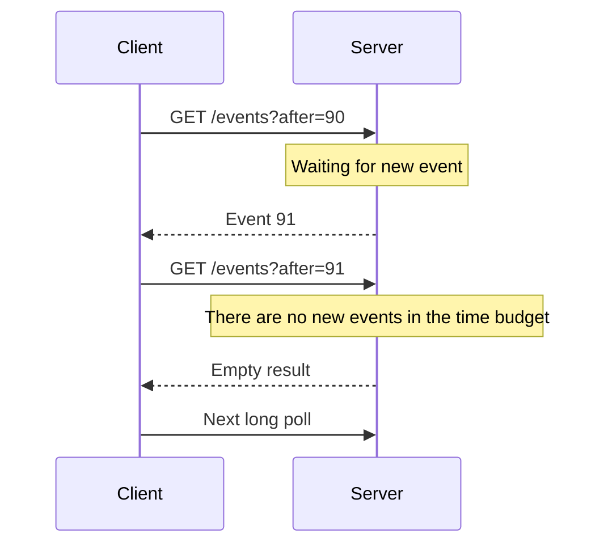

# Polling and long polling

An interface that feels live does not always require a persistent two-way connection. If the state changes infrequently and a delay of a few seconds is acceptable, repeated HTTP requests can be a simple solution. To make the decision, we examine the freshness, the number of clients and the cost of the requests together.

## Polling

During polling, the client retrieves the current status at regular intervals. For example, it checks the status of an export job every five seconds. It has the advantage of standard HTTP infrastructure, easy restart and no persistent connection state.

Polling period directly affects latency. If the time of the change is evenly distributed in the period, on average there is a wait of about half a period, plus the time of the request. For five-second polling, this is 2.5 seconds in an illustrative model.

Ten thousand clients make about two thousand requests per second every five seconds, even if the state does not change. Conditional request and cache can reduce the payload, but the cost of request management remains. The jitter of launching clients can avoid a spike in time.

## Adaptive polling

For pending tasks, the frequency may change: initially a short period, later a longer one, shutdown in the final state. The server can suggest a next check time. The client should not start a new request if the previous one is still running, otherwise more and more parallel requests will accumulate on a slow network.

"no change" and "failed to retrieve" are separate states. The interface can indicate the last update of the data and reduce the attempt after a network error. In the event of a permanent authorization error, do not continue polling indefinitely.

## Long polling

With long polling, the server keeps the request open until new data arrives or a time budget expires. After a response, the client opens a new request. This can reduce blank responses and event detection latency.

An event may occur between the response and the new request. Cursor and server-side retention is required if this should not be lost. Proxy timeout and server timeout must match. The cost of new connections and headers continues to recur.

## Choosing between them

Polling can be good with infrequent status changes, a simple task server and not strict freshness requirements. Long polling is useful when a small delay is needed, but a persistent stream is not suitable for other reasons. For frequent messages, SSE or WebSocket can provide more efficient interaction.

> [!tip] Start from the need for freshness
> If minute-by-minute status is enough for the user, don't automatically schedule a millisecond live connection. If you need immediate two-way control, infrequent polling is probably not enough.

## Calculation exercise

Calculate the request rate of 30,000 clients at 2, 10 and 30 second polling. Enter the approximate average detection delay. Then design the cursor for long polling and re-requesting after a network failure.
