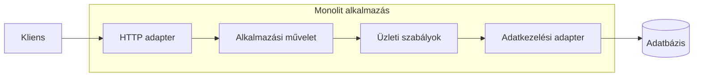

# 01.02. A monolit: egyszerű határ, összetett belső szerkezet

A monolit egy olyan alkalmazás, amelynek fő üzleti funkciói egy közös telepítési egység részei. Ez nem jelent rendezetlen kódot. A monolitnak lehet réteges, komponensalapú vagy moduláris belső architektúrája; a közös tulajdonság a kiadás és a futtatás határa.

## Egy kérés útja a monolitban

Egy HTTP-kérést a webes adapter fogad, az alkalmazási réteg elindítja a műveletet, a domainréteg alkalmazza az üzleti szabályokat, majd az adatkezelési adapter végrehajtja a mentést. Ezek között többnyire helyi hívások történnek. A vezérlés, a kivételek és a tranzakció környezete egy folyamaton belül követhető.

A rétegek nem szolgáltatások. Ha a domainréteg külön fájlban vagy csomagban van, attól nem lépett be új hálózati határ. A függvényhívások költsége és hibahelyzetei alapvetően mások, mint egy távoli API-hívásé.

## Miért előnyös?

A fejlesztő egy alkalmazást indít, a hibakereső egy hívási vermet lát, a kiadási folyamat egy artifactot állít elő. Az üzleti művelet több táblát is módosíthat egy helyi adatbázis-tranzakcióban. A részek közötti hívásokhoz nem kell hálózati szerződés, discovery, timeout és távoli identitás.

Kevés fejlesztővel, gyorsan változó termékhatárokkal ez komoly előny. A még bizonytalan felelősségeket olcsóbb folyamaton belül átrendezni, mint több szolgáltatás és adatgazda között. Ha egy mező jelentése megváltozik, a használói egy közös kiadásban frissülhetnek.

A monolit horizontálisan is skálázható: több példány fogadhat kéréseket egy terheléselosztó mögött. Ehhez a munkamenet és a tartós állapot elhelyezését tudatosan meg kell tervezni. A monolit tehát nem azonos az „egy szerveren fut” állítással.

## Hol jelentkezik a költség?

Közös a kiadás kockázata és a folyamat erőforráskerete. Egy memóriaszivárgás más funkciókat is érinthet. Ha csak a képfeldolgozás CPU-igénye nő, az egész alkalmazásból kell új példányokat indítani, hacsak a feldolgozást nem szerveztük külön futtatható egységbe.

Nagyobb szervezetben a közös kód és pipeline egyeztetési ponttá válhat. A hosszú tesztidő, a nagy regressziós felület és a gyakori konfliktus lassíthatja a változtatást. Ezek azonban nem pusztán a monolit létezéséből következnek: rossz modulhatárok és elhanyagolt tesztek is okozhatják őket.

## Mikor érdemes megtartani?

Ha az alkalmazás fő részei együtt változnak, közös tranzakciókat igényelnek, és a csapat egyetlen kiadást hatékonyan kezel, a monolit jó választás lehet. Az architektúra fejlődését nem a szolgáltatások számán mérjük. Először azt vizsgáljuk, melyik konkrét probléma nem oldható meg a belső szerkezet javításával.

> [!warning] A „monolit” nem hibadiagnózis
> A körkörös függőség, a korlátlan táblahozzáférés és az óriási osztályok tervezési problémák. Szétköltöztetésük önmagában ezeket nem javítja meg.

## Elemzési feladat

Egy négyfős csapat napi kétszer ad ki egy alkalmazást. A katalógus és a rendeléskezelés stabilan működik, a képfeldolgozás viszont elfogyasztja a CPU-t. Sorolj fel három lehetséges megoldást, és különítsd el az erőforrás-elkülönítés problémáját a teljes rendszer mikroszervizesítésétől.
