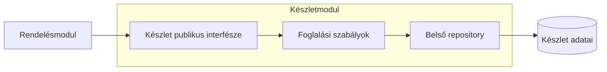

# 01.03. Modulit: moduláris monolit és belső szerződések

A modulit kifejezést ebben a tananyagban **moduláris monolit** értelemben használjuk. Egy közös telepítési egységen belül önálló felelősségű modulokat alakítunk ki. A modulok közötti kapcsolat szűk, tudatosan tervezett interfészen keresztül történik; a belső implementáció és adatkezelés rejtett.

## Mitől lesz valódi modulhatár?

A mappanév csak jelölés. Határ akkor van, ha a többi modul nem tud tetszőlegesen belenyúlni az implementációba. A katalógusmodul például exportálhat `getProductSummary(productId)` műveletet, de nem exportálja az adatbázis-kapcsolatát és az összes belső entitását.

Az interfész az üzleti jelentést fejezi ki. A `reserveStock` több információt hordoz, mint a `updateInventoryRow`: megnevezi a szándékot, és a készletmodulra bízza a szabályok érvényesítését. A hívó ne állítsa össze saját maga a másik modul belső állapotát.

## Függőségek és adatgazdák

A függőségi gráf lehetőleg egyértelmű és körmentes. Ha a rendelés hívja a készletet, a készlet pedig visszahívja a rendelés belső logikáját, a két modul együtt változó egységgé válhat. A kör megszüntethető egy magasabb szintű alkalmazási koordinátorral vagy eseményekkel, de az események jelentését is meg kell tervezni.

A közös adatbázis mellett is kijelölhető táblánkénti adatgazda. A rendelésmodul ne írja közvetlenül a készlettáblát. Az adatgazda szabálya megakadályozza, hogy egy másik modul megkerülje az invariánsokat. Adatbázisjogosultságok, külön sémák és automatizált függőségellenőrzések erősíthetik ezt a megállapodást.

A közös tranzakció továbbra is lehetséges, de tudatos döntés. Ha egy művelet több modul adatát egyetlen tranzakcióban módosítja, a későbbi szolgáltatáskiválasztáskor ezt a garanciát újra kell tervezni. A moduláris szerkezet nem teszi automatikussá a mikroszervizre váltást.

## Előnyök és korlátok

A modulit megtartja a helyi hívások egyszerűségét és a közös futtatási környezetet, miközben csökkenti a belső csatolást. Külön egységtesztelhető felelősségeket és átlátható adatgazdákat ad. A csapat fokozatosan tisztázhatja a rendszerhatárokat hálózati költség nélkül.

Ugyanakkor közös marad a kiadás, a folyamat kiesése és többnyire a skálázás. A modulok nem kapnak önálló hálózati identitást és külön rendelkezésre állási határt. Egy belső interfész kompatibilitását gyakran közös fordítás ellenőrzi; szolgáltatásközi API-nál a régi és új verziók együttélése is szükséges.

> [!tip] A kiválasztás előtt tedd láthatóvá a határt
> Ha egy modult később önálló szolgáltatássá szeretnél alakítani, először szüntesd meg a közvetlen belső hozzáféréseket. Így láthatóvá válnak a valódi hívások és az adatigények.

## Tervezési ellenőrzés

Válassz két modult, és írd le a publikus műveleteiket, az adatgazdáikat és a megengedett függőség irányát. Mutass egy olyan módosítást, amely belső implementációcsere, és egyet, amely a modulinterfészt is megváltoztatja. Indokold meg, miért különbözik a két változtatás hatása.
