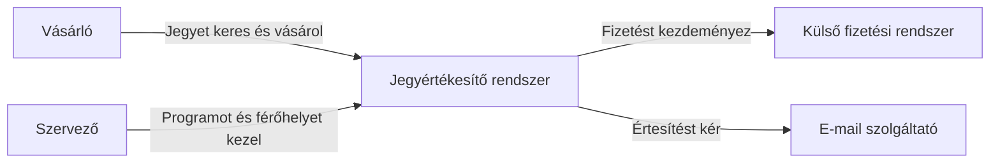
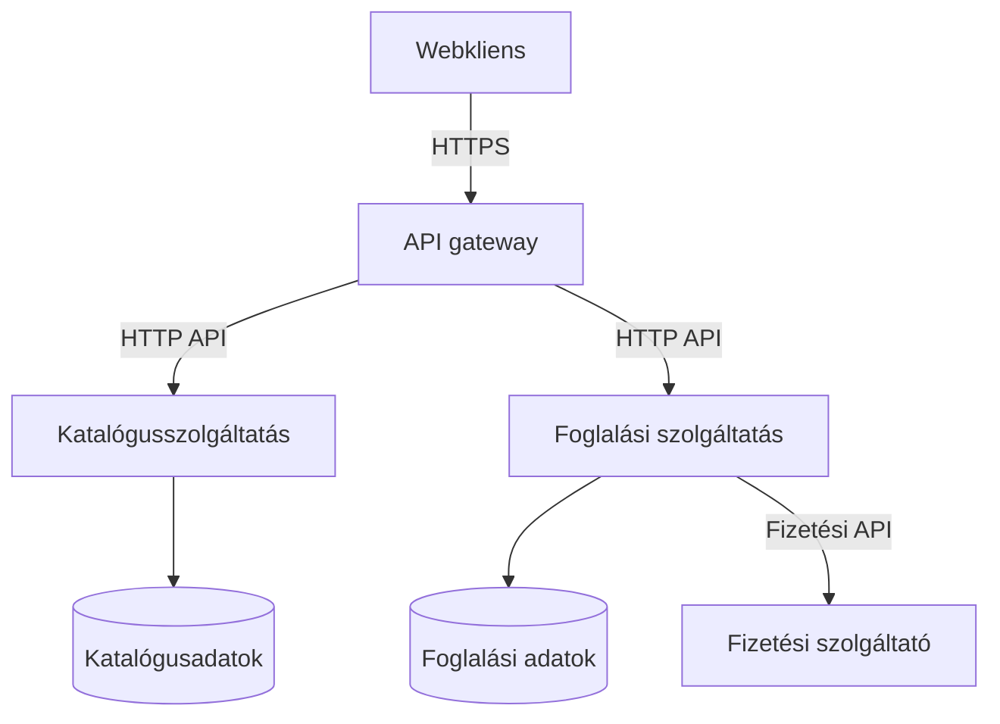
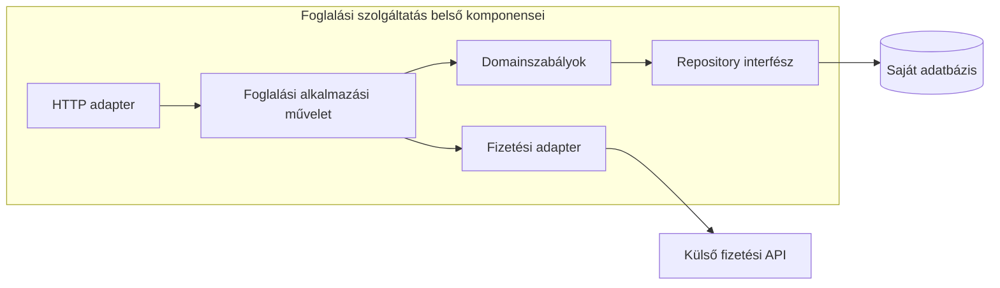
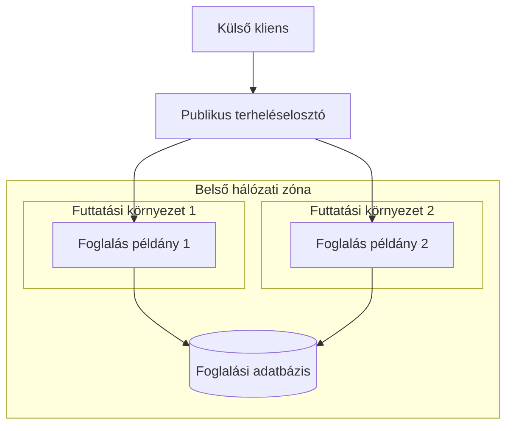

# 02.02. C4, komponensdiagram és deploymentnézet

Egy diagram egy meghatározott kérdésre válaszol. Ha ugyanazon ábrába keverjük a felhasználókat, osztályokat, adatbázistáblákat és szerverpéldányokat, az olvasó nem tudja, milyen szinten kell értelmeznie a kapcsolatokat. A C4 modell egymásba nagyítható nézeteket ad; a négy szintből csak a kérdéshez szükségeseket használjuk.

## Rendszerkörnyezet: mi van kívül és belül?

A contextnézet a vizsgált rendszert egy egységként mutatja. Mellette a felhasználók és külső rendszerek szerepelnek. Itt nem fontos, hogy belül REST vagy gRPC működik: azt magyarázzuk, ki mire használja a rendszert, és milyen külső függőségei vannak.

Ez C4-szemléletű contextábra általános Mermaid-jelöléssel. A dobozok és nyilak nem hivatalos C4 ikonok; a nézet szintjét és az elemek jelentését a címkék adják.

## Container: a futtatható egységek

A C4 container alkalmazást vagy adattárolót jelent, nem feltétlenül Docker-konténert. A nézet megmutathat böngészős alkalmazást, API-t, háttérfeldolgozót és adatbázist. Mikroszervizes rendszerben a szolgáltatások ilyen szinten jelenhetnek meg.

Minden nyílhoz érdemes irányt, célt és kommunikációs módot adni. A „kapcsolódik” felirat túl kevés: nem mondja meg, ki kezdeményez, mit kér, és miért szükséges a kapcsolat.

## Component: egy egység belseje

A komponensnézet egy szolgáltatás belső felelősségeit bontja ki: például HTTP-adapter, foglalási alkalmazási művelet, domainmodell, repository és fizetési adapter. Ne keverjük ezeket a külön folyamatokkal. A komponensdiagram az implementáció szervezését, a containerdiagram a magasabb futási határokat magyarázza.

A kódszintű nézet osztályokat és interfészeket mutathat. Akkor érdemes használni, ha valóban egy belső megoldást kell megérteni. Az összes osztály automatikus kirajzolása ritkán hasznos architektúradokumentum.

## Deployment: hol futnak a példányok?

A deploymentnézet gépeket, futtatási környezeteket, hálózati zónákat és példányokat mutat. Kiderülhet belőle, hogy három gateway és négy foglalási példány fut, de csak egy közös adatbázis rendelkezik írási szereppel. Ez az erőforrások, az elérhetőség és a bizalmi határok elemzéséhez kell.

A logikai szolgáltatás és a példánya külön elem. Ha a diagram négyszer rajzolja ki ugyanazt a szolgáltatást, nevezzük meg, hogy négy replika szerepel. Ha két külön üzleti felelősséget rajzolunk, ne nevezzük őket ugyanazon szolgáltatás példányainak.

A két példány egy logikai szolgáltatáshoz tartozik. Az ábra a hálózati és futtatási elhelyezést mutatja, nem két önálló üzleti szolgáltatást. Az adatbázis magas rendelkezésre állásának belső részleteit itt elhagytuk.

> [!tip] A cím legyen kérdésre adott válasz
> „A foglalási rendszer külső kapcsolatai” és „A foglalási szolgáltatás három példányának elhelyezése” két külön diagram. A cím és a jelmagyarázat tegye ezt egyértelművé.

## Diagramellenőrzés

Ellenőrizd a nézet szintjét, a rendszerhatárt, az elemek felelősségét és a nyilak jelentését. Az ábra mellett rövid szöveg rögzítse, mely részleteket hagytad el. A C4 szintek és kiegészítő nézetek hivatalos leírása: [C4 diagrams](https://c4model.com/diagrams).
