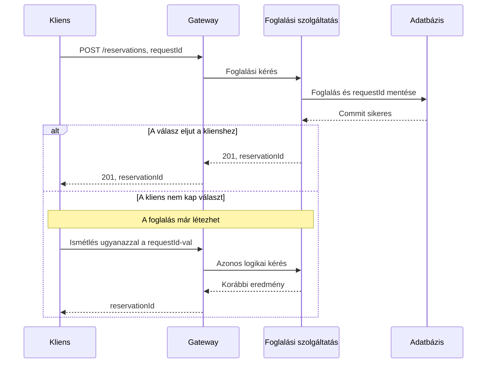
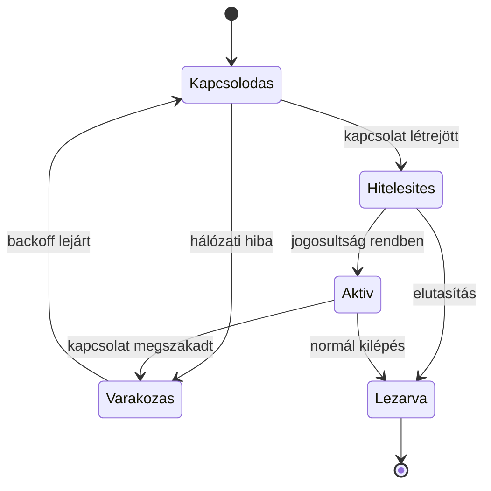

# 02.04. Szekvencia- és állapotdiagramok

A szekvenciadiagram az együttműködő résztvevők üzeneteit időbeli sorrendben mutatja. Az állapotdiagram egyetlen elem lehetséges állapotait és az átmeneteket írja le. A kettő kiegészíti egymást: az egyik azt magyarázza, ki kivel kommunikál, a másik azt, milyen állapotváltozást okoz ez.

## Szekvenciadiagram: résztvevők és üzenetek

A függőleges vonalak a résztvevők életvonalai. Az idő felülről lefelé halad. A résztvevő lehet böngésző, szolgáltatás, broker vagy adatbázis, de egy ábrán lehetőleg azonos szintű felelősségeket mutassunk. Az üzenetet művelettel és fontos adattal címkézzük.

Az `alt` alternatív útvonalakat jelöl, az `opt` opcionális lépést, a `loop` ismétlést, a `par` párhuzamos szakaszt. Egy aszinkron üzenetnél külön magyarázd el, ki nyugtázza a fogadást és ki jelenti a tényleges feldolgozás eredményét. A válasznyíl nem mindig üzleti siker.

A diagram időbeli sorrendet mutat, de nem pontos időskálát. Két nyíl távolsága nem jelent automatikusan 20 ms késleltetést. Ha időkeretet elemzünk, írjuk mellé a mért vagy feltételezett időket.

## Állapotdiagram: az életciklus szabályai

Egy kapcsolat nem egyszerűen „van” vagy „nincs”. Létrejöhet, hitelesítésre várhat, aktív lehet, megszakadhat, majd újraszinkronizálhat. Az állapotdiagram azokat az átmeneteket mutatja, amelyek megengedettek.

Az állapothoz tartozó adatokat is nevezzük meg. Egy `Függő` fizetésnek kell műveletazonosító, indulási idő és egyeztetési határidő. Egy `Aktív` kapcsolatnak lehet feliratkozáskészlete és utolsó feldolgozott eseményazonosítója. Az állapotnév ezek nélkül kevés a működéshez.

## Invariánsok és hiányzó átmenetek

Az invariáns olyan szabály, amely minden megengedett állapotban igaz. Például lezárt foglaláshoz nem adható új ülőhely. A műveletet a szolgáltatásnak kell ellenőriznie, nem csupán a felület gombját elrejtenie.

Vizsgáljuk meg a késői üzeneteket is. Mi történik, ha a foglalás már lejárt, de később megérkezik a fizetés sikeréről szóló értesítés? A hiányzó átmenet nem jelenti azt, hogy a valóságban nem érkezhet ilyen üzenet. Elutasítás, visszatérítés vagy egyeztetés szükséges.

> [!important] Ugyanazt a folyamatot két nézetben ellenőrizd
> Minden fontos szekvenciaüzenethez rendelj állapotváltozást vagy indokold meg, hogy nem módosít állapotot. Így észrevehető a „válaszoltunk, de nem mentettünk” és a „mentettünk, de nincs helyreállítási út” hiba.

## Tervezési feladat

Készíts állapotdiagramot egy exportfeladatról `Várakozik`, `Fut`, `Elkészült`, `Sikertelen` és `Megszakítva` állapotokkal. Szekvenciadiagramon mutasd meg a létrehozást, a worker általi felvételt és az eredmény lekérdezését. Tisztázd a worker kiesése utáni átmenetet.
