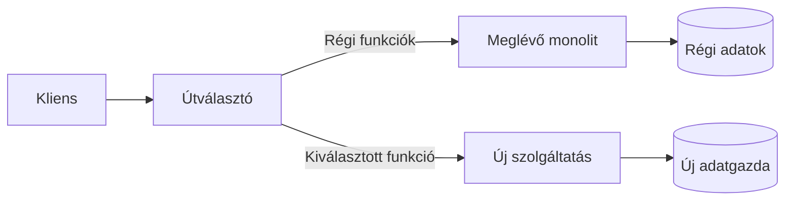

# 02.05. Tervek összehasonlítása és fokozatos rendszerátalakítás

A diagram akkor segít a döntésben, ha az alternatívák következményei is láthatók. Egy szép mikroszervizes ábra nem bizonyítja, hogy az alkalmazás jobban működik majd. A tervet konkrét változtatásokkal, terheléssel és hibafolyamatokkal vizsgáljuk.

## Ugyanaz a követelmény több tervben

Egy katalógus és egy rendeléskezelés háromféleképpen is megvalósítható. Monolitban közös kiadás és helyi hívás van. Modulitban szűk belső interfészek választják el a felelősségeket. Külön szolgáltatásoknál hálózati API és önálló adatgazdák jelennek meg.

Az összehasonlításhoz azonos kérdéseket használjunk. Ki módosítja a termékadatot? Hogyan kerül a rendelésbe a vásárláskori ár? Mi történik, ha a katalógus nem elérhető? Melyik változtatás igényel két kiadást? Hol ellenőrizzük a kompatibilitást? Ha az egyik tervnél csak az előnyöket, a másiknál csak a hibákat soroljuk, nincs valódi összehasonlítás.

## Architektúradöntés rövid dokumentálása

Az ADR, azaz architecture decision record egy konkrét döntés indoklását rögzíti. Használható szerkezete:

- **Helyzet:** milyen követelmény és korlát mellett döntünk?
- **Alternatívák:** mely megoldásokat vizsgáltuk?
- **Döntés:** mit választottunk és milyen határok között?
- **Következmények:** mit nyerünk, mit vállalunk, mit kell ellenőrizni?
- **Felülvizsgálat:** milyen változás indokolhat új döntést?

Például a keresést külön szolgáltatásba szervezzük, mert saját indexet használ, eltérő terhelési profilja van, és a katalógus módosításai után elfogadható rövid késés. Következményként meg kell tervezni az indexfrissítést, az elavult találatok kezelését és az újraépítést. A „mikroszervizek skálázhatók” állításnál ez sokkal konkrétabb indoklás.

## Strangler pattern

Fokozatos átalakításkor az új működés a régi mellé kerül. Egy router vagy proxy bizonyos útvonalakat az új szolgáltatáshoz irányít, a többit a régi alkalmazás kezeli. Lépésenként csökken a régi rendszer felelőssége.

A routing átváltása csak a látható lépés. Az adatgazda átadását, a folyamatban levő műveleteket és a régi fogyasztókat is kezelni kell. A migráció alatt különösen veszélyes két, egymástól független írót létrehozni ugyanarra az üzleti állapotra.

## Anti-corruption layer

Ha az új modell a régi rendszerrel kommunikál, egy adapter lefordíthatja a régi fogalmakat az új kontextus nyelvére. Ez az anti-corruption layer megakadályozza, hogy a régi adatmodell korlátai minden új komponensbe beszivárogjanak. Az adapter nem pusztán mezőátnevezés: a jelentésbeli különbséget és a hibákat is kezeli.

## A terv minőségének ellenőrzése

Olvasd végig az ábrát egy sikeres, egy sikertelen és egy ismételt művelettel. Ellenőrizd az adatgazdát minden módosításnál. Keresd a körkörös hívásokat, a rejtett közös táblákat és a túl hosszú szinkron láncot. Minden új dobozhoz tedd fel: mi indokolja a külön életciklust?

> [!tip] A terv és a döntés együtt éljen
> A diagram megmutatja a szerkezetet; az ADR megmagyarázza, miért ilyen. Változtatáskor mindkettőt frissítsd, különben a rajz elveszíti az indoklását.

## Ellenőrző kérdések

1. Miért nem elég az útvonalat az új szolgáltatáshoz irányítani egy funkció kiválasztásakor?
2. Mi legyen egy adatgazda-átadás visszaállítási feltétele?
3. Fogalmazz ADR-t a keresőszolgáltatás kiválasztásáról, és adj hozzá egy mérhető felülvizsgálati feltételt.
