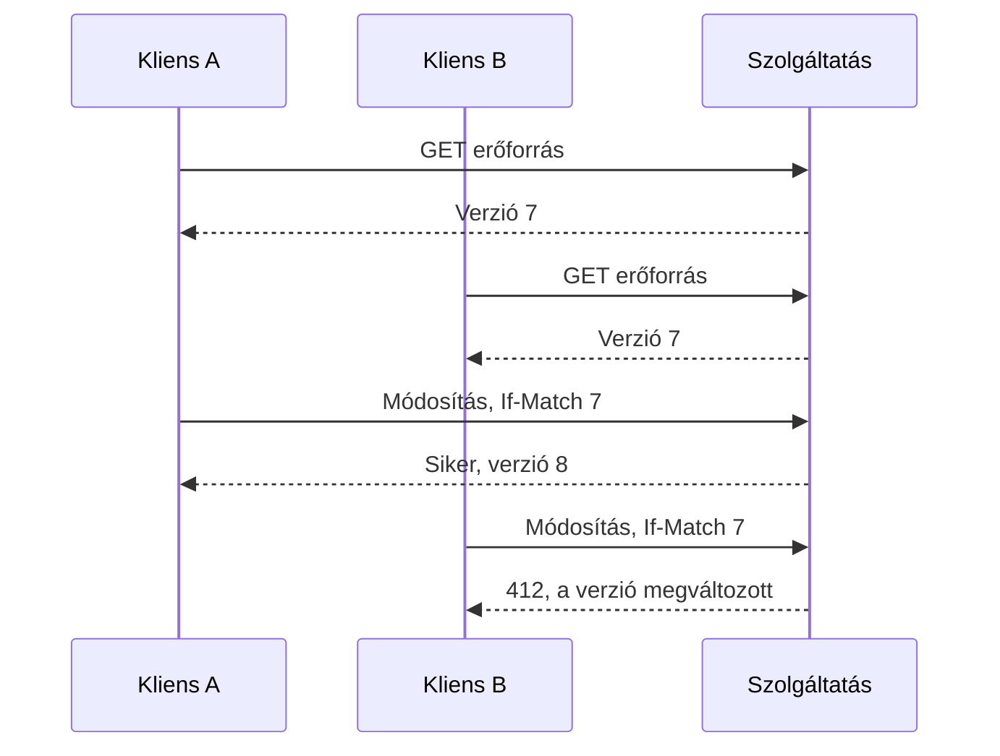

# 04.02. HTTP API: hibák, cache, konkurencia és hosszú műveletek

Egy használható HTTP API a sikeres példán túl a hibákat és a konkurens módosítást is megtervezi. A fogyasztónak meg kell tudnia különböztetni a hibás bemenetet, a hiányzó erőforrást, az ütközést, a túlterhelést és az átmeneti függőségi hibát.

## Státusz és hibareprezentáció

A `201 Created` létrehozott erőforrást jelezhet, a `202 Accepted` elfogadott, de még be nem fejezett feldolgozást. A `400` hibás kérést, a `401` hitelesítéshez kapcsolódó hiányt vagy hibát, a `403` tiltott hozzáférést, a `404` nem található erőforrást jelez. A `409` konfliktus, a `412` sikertelen előfeltétel, a `429` túl sok kérés esetén használható. A státusz mellé stabil alkalmazási hibakód és kezelhető részletek kerüljenek.

Ne kényszerítsd a klienst emberi mondatok összehasonlítására. A `code: "RESERVATION_EXPIRED"` programozottan kezelhető, míg a megjelenített szöveg nyelvenként változhat. A hibaválasz ne közölje a belső stack trace-t és a titkos konfigurációt.

## Cache és feltételes olvasás

A cache csökkentheti az ismételt kérés költségét, de meg kell adni az adat frissességének és megoszthatóságának szabályait. Egy nyilvános programkatalógus más cache-kezelést igényel, mint egy személyes számlalista. A proxy és a böngésző tárolását is figyelembe kell venni.

Egy `ETag` a reprezentáció verzióját azonosíthatja. A kliens `If-None-Match` feltétellel jelezheti, hogy már rendelkezik egy verzióval; változatlan állapotnál a szerver `304` választ adhat. Ez kevesebb adatátvitelt jelent, de nem teszi költségmentessé a szerveroldali ellenőrzést.

## Konkurens módosítás

Ha két kliens ugyanazt a régi állapotot olvasta, a második módosítás felülírhatja az elsőt. Egy feltételes írás például `If-Match` és erős ETag alapján csak akkor sikerül, ha a kliens ismert verziója még aktuális. A szervernek az ellenőrzést és az írást együtt kell érvényesítenie.

Az ütközés után a kliens újraolvashatja az állapotot és a felhasználóval dönthet. Az automatikus újraküldés a friss verzióval veszélyes, ha ezzel jóváhagyás nélkül felülírná a másik módosítását.

## Hosszú művelet és lapozás

Egy nagy exportot nem szükséges nyitott kérésben végig megvárni. A szerver létrehozhat feladaterőforrást, visszaadhatja az azonosítóját, majd a kliens állapotot kérdez. A szerződés rögzítse az elkészült eredmény helyét, a hibát, a lejáratot és a megszakítás lehetőségét.

Listáknál a lapozás korlátozza a válasz méretét. Az offset egyszerű, de változó adathalmazban eltolódhatnak az elemek. A cursor egy megállapodott rendezési pontot jelölhet. A stabil rendezéshez gyakran azonosítóval kiegészített rendezési kulcs kell; az önkényes adatbázissorrend nem megfelelő szerződés.

> [!important] Az OpenAPI leírja, amit megterveztél
> A séma, a példák és a generált kliens segítik az együttműködést. Nem döntik el helyetted az ismétlés, a jogosultság, a konkurencia és az üzleti hibák jelentését.

## Szerződésellenőrzés

Egy módosító API-nál vizsgáld a hibás bemenetet, a hiányzó jogosultságot, a verzióütközést, az elveszett választ és a megismételt kérést. Ezekhez rögzíts elvárt státuszt és állapotváltozást. A kliens működését ne csak a sikeres választest alapján tervezd.
