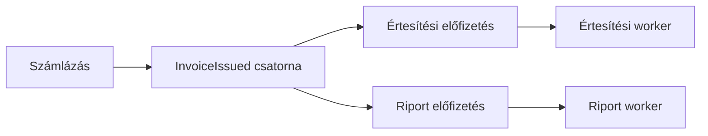

# 06.01. Queue, publish–subscribe és eseménynapló

Aszinkron szolgáltatáskapcsolatban a küldő üzenetet bocsát ki, a fogyasztó pedig később dolgozza fel. Közöttük broker vagy más üzenetközvetítő állhat. A kommunikáció jelentését a küldött parancs vagy esemény adja, az infrastruktúra pedig az átvitelt, tárolást és kézbesítést szervezi.

## Munkasor

Egy queue mögött több worker versenyezhet ugyanazon munkák feldolgozásáért. Egy exportfeladatot általában egy workernek kell végrehajtania, nem mindegyiknek. A munkasor szétosztja a terhelést és pufferelheti az átmeneti forgalomnövekedést.

A sor nem növeli végtelenül a kapacitást. Ha tartósan másodpercenként 100 feladat érkezik, de csak 80 készül el, a várakozó munka egyre nő. A sorhossz mellett a legöregebb üzenet kora is fontos: megmutatja a felhasználó által érzékelt késést.

## Publish–subscribe

Pub/sub modellben egy tényt több önálló fogyasztó is megkaphat. A `InvoiceIssued` eseményre az értesítés, a riport és a könyvelési integráció más-más módon reagál. Mindegyik fogyasztó saját felelősségéhez tartozó eredményt állít elő.

A fogyasztói másolat vagy előfizetés önálló feldolgozási állapotot igényel. Ha az értesítés workerből három példány fut ugyanazon előfizetéshez, azok tipikusan az értesítési munkát osztják meg; a riport ettől függetlenül megkapja ugyanazt a tényt.

## Tartós log és consumer group

Eseménynaplóban a rekordok egy ideig megmaradnak, a fogyasztó pedig saját pozícióját követi. Az adatok újraolvashatók, amíg a megőrzési szabály engedi. Consumer groupban a tagok megoszthatják a partíciók feldolgozását; külön csoportok önállóan haladhatnak ugyanazon adatfolyamon.

A queue és a log közötti különbséget ne egyetlen terméknév alapján értelmezzük. A kézbesítési modell, a megőrzés, a pozíciókezelés és a visszajátszás a fontos. Egy infrastruktúra többféle mintát támogathat, eltérő konfigurációval.

## Eseményszerződés

Egy eseménynek legyen stabil típusa, azonosítója, sémaverziója és üzleti jelentése. Az időpont megmondhatja a tény keletkezését, de nem garantál globális sorrendet. Az adatgazda ne a teljes belső tábláját küldje automatikusan minden változáskor.

A tény tartalmazhat elegendő adatot a fogyasztóhoz, vagy csak azonosítót, amelyből később lekérdezés kell. Az első megoldás több adatot és sémát visz, a második visszahozhat szinkron függőséget. A választás a frissesség, az adatvédelem és a rendelkezésre állás követelményeitől függ.

> [!important] Az esemény nem a belső adatbázis nyilvános másolata
> A publikus esemény az együttműködés szerződése. A fogyasztót ne kösd olyan implementációs részletekhez, amelyeket a producer önállóan szeretne változtatni.

## Tervezési feladat

Válassz modellt három esetre: képek feldolgozása, számla kiállításáról szóló értesítés több rendszernek, keresési index újraépítése korábbi változásokból. Mindegyiknél nevezd meg, ki kapja az adatot, meddig kell megőrizni, és mi történik egy fogyasztó kiesésekor.
