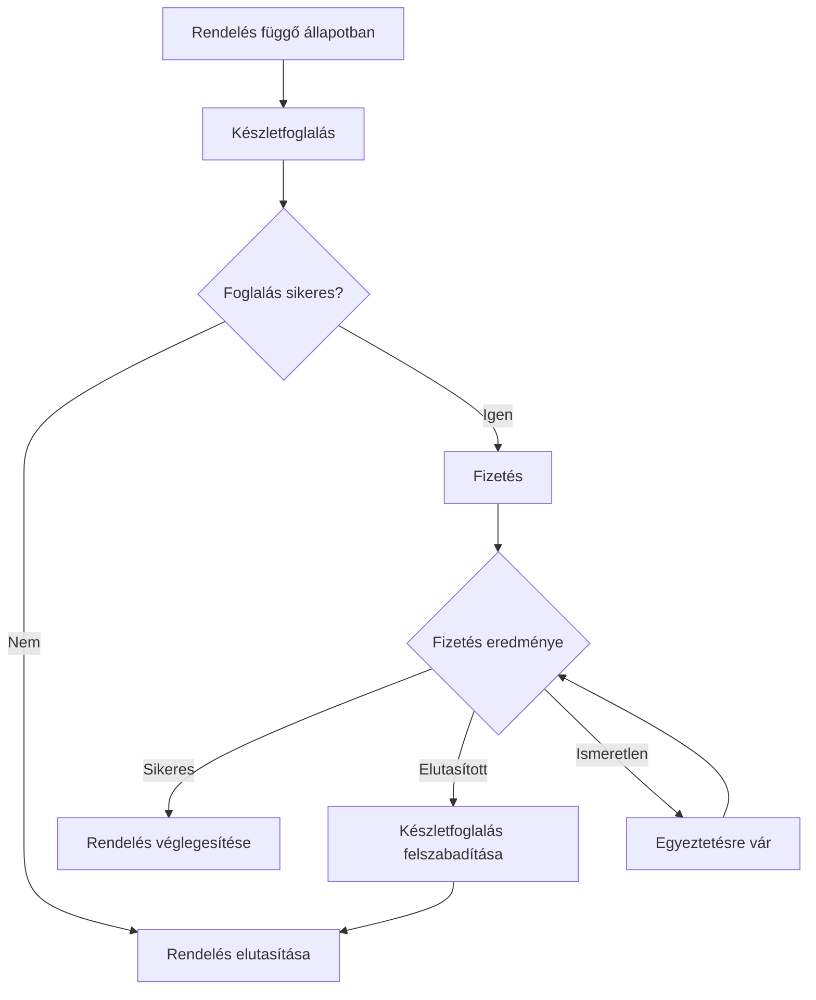

# 07.02. Saga: orchestration, choreography és kompenzáció

A saga több szolgáltatást érintő üzleti folyamatot helyi tranzakciók sorozatával valósít meg. Ha egy későbbi lépés meghiúsul, korábbi lépésekhez kompenzáló műveletek tartozhatnak. A saga nem közös ACID-tranzakció: köztes állapotok láthatók lehetnek, és a helyreállítás is időt igényelhet.

## Egy folyamat lépései

Egy rendeléshez készletet foglalunk, fizetést kérünk, majd véglegesítünk. A készletgazda saját állapotát módosítja, a fizetés másik adatgazdához tartozik, a rendelési állapotot pedig a rendeléskezelés tartja nyilván. Az egyes lépések külön eredményt és azonosítót kapnak.

Az „ismeretlen” állapot nem azonos a hibával. A későbbi egyeztetéshez tartós műveletazonosító és szabály kell. Az ábra egy egyszerű modellt mutat; a kompenzáció hibája további helyreállítási állapotot igényelhet.

## Orchestration

Orchestration esetén egy koordinátor tartja nyilván a folyamat állapotát és indítja a következő parancsot. Látható, hol tart a folyamat, mely lépés vár és milyen kompenzáció szükséges. A koordinátor tartós állapotát újraindulás után is folytatni kell tudni.

Előnye az áttekinthető vezérlés és az egy helyen leírt folyamatszabály. Költsége a koordinátor szerződése, rendelkezésre állása és a központi folyamatlogika kezelése. A koordinátor ne vegye át a szolgáltatások saját belső invariánsait.

## Choreography

Choreography esetén a szolgáltatások eseményekre reagálnak. A rendelés létrehozása készletfoglalást indíthat, a foglalás eseménye fizetést, a fizetés eredménye véglegesítést. Nincs feltétlenül egyetlen vezérlő, de a teljes folyamat továbbra is létezik és megfigyelést igényel.

Kevés, jól érthető reakciónál ez csökkentheti a központi függést. Sok ág és ciklus mellett a folyamat nehezen követhetővé válhat. Egy új fogyasztó látszólag egyszerű eseménykapcsolata új üzleti visszacsatolást is létrehozhat.

## A kompenzáció üzleti művelet

A kompenzáció nem időutazás. Egy terhelés visszatérítése új pénzügyi művelet, nem az eredeti rekord eltüntetése. Egy foglalás felszabadítása után más is elviheti a készletet. A saga nem biztosítja automatikusan, hogy más műveletek nem látják a köztes állapotot.

Kompenzáló parancs is ismétlődhet és hibázhat. Saját idempotencia, retry és végleges egyeztetési út kell hozzá. Ha automatikus helyreállítás nem lehetséges, a rendszernek felismerhető, követhető állapotot kell adnia.

> [!warning] A saga nem elosztott rollback
> A helyi tranzakciókat már mások is láthatják. A kompenzáció az üzleti következményt rendezi a megengedett szabályok szerint.

## Tervezési feladat

Írj orchestration- és choreographytervet ugyanarra a rendelési folyamatra. Jelöld, ki tárolja az állapotot, hol követhető a teljes művelet, és mi történik a fizetés után kieső rendelési szolgáltatással. A válaszban ne feltételezz egyszeri vagy tökéletesen rendezett üzenetkézbesítést.

Mintaleírás: [Saga pattern](https://microservices.io/patterns/data/saga.html).
