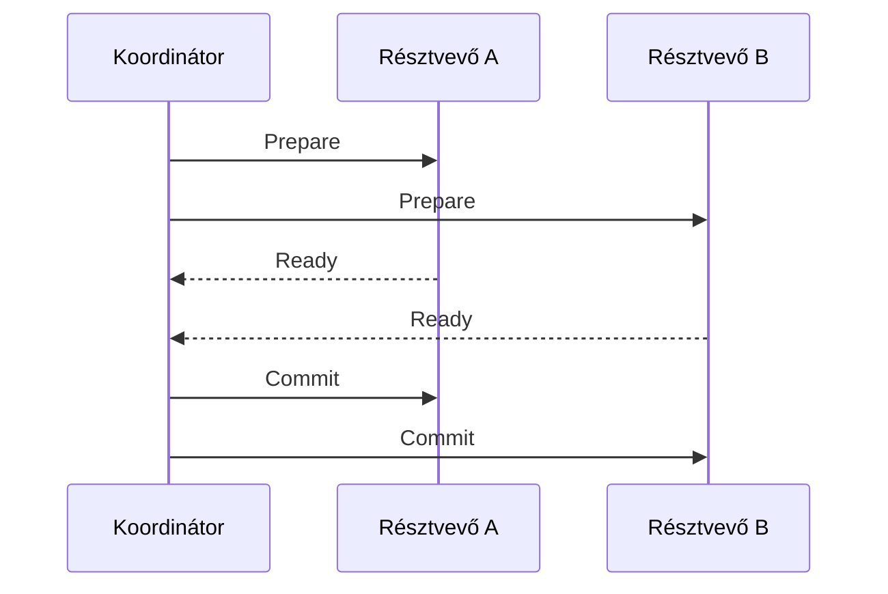

# 07.05. Elosztott tranzakció, izoláció és üzleti határok

A több szolgáltatást érintő művelet atomiságát és izolációját külön kell elemezni. Az „ACID adatbázisokat használunk” állítás az egyes adatbázisok helyi tranzakcióira vonatkozik. Nem terjed ki automatikusan a másik szolgáltatás commitjára vagy egy külső API-hívásra.

## Kétfázisú commit

A two-phase commit, röviden 2PC egy koordinátorral egyezteti a résztvevők közös commitját. Először a résztvevők előkészítik a tranzakciót és jelzik, hogy készek-e. Ezután a koordinátor commit- vagy rollbackdöntést közöl.

A megoldás csak megfelelő protokollt és tranzakciós képességet támogató résztvevőkkel alkalmazható. Egy tetszőleges HTTP-végpont nem válik 2PC-résztvevővé attól, hogy a koordinátor két kérést küld neki.

A felkészített tranzakció erőforrást tarthat fenn. Koordinátor- vagy hálózati hiba esetén bizonytalan állapot és várakozás keletkezhet. A helyreállítás, timeout és naplózás a protokoll működésének része. A közös commitért cserébe erősebb futási és infrastruktúrafüggés jelenik meg.

## Saga és izoláció

Saga esetén a helyi tranzakciók már végrehajtódtak, amikor a következő lépés indul. Más művelet láthatja a köztes állapotot. Például egy foglalás „függő fizetés” állapotban tartja a készletet; egy másik vásárló ezt már nem viheti el, noha a teljes folyamat még nem végleges.

A köztes állapothoz explicit szabály kell. Használható ideiglenes foglalás lejárattal, állapothoz kötött műveletengedély vagy verzióellenőrzés. Ezek az üzleti izolációt segítik, de nem teljesen azonosak egy közös adatbázistranzakció izolációjával.

## Versengő műveletek

Két párhuzamos saga egyszerre ugyanarra a készletre kérhet foglalást. A készletgazdának helyben atomi döntést kell hoznia. Ha mindkét hívó a korábbi elérhetőségi másolat alapján külön „sikeresnek” tekinti a foglalást, túlfoglalás keletkezhet.

Hasonló probléma, ha a kompenzáció későn érkezik. A felszabadítás csak a hozzá tartozó konkrét foglalást érintheti, nem a termék teljes mennyiségét állíthatja vissza vakon. A műveletazonosító és az állapotellenőrzés megakadályozza, hogy egy régi kompenzáció új foglalást rontson el.

## A határ újragondolása

Ha két adat minden műveletben azonnali, közös invariánst igényel, érdemes megvizsgálni, valóban külön adatgazdához kell-e tartozniuk. A rossz felbontás nem mindig több infrastruktúrával javítható. Egy moduláris monolit vagy nagyobb, kohézív szolgáltatás egyszerűbb és helyesebb lehet.

A külön szolgáltatás indoka ugyanakkor lehet szabályozási vagy szervezeti követelmény. Ilyenkor vállaljuk a folyamatállapotot és egyeztetést, és pontosan megmondjuk, mi garantált. A technológiai választás nem írhatja át csendben az üzleti elvárást.

> [!important] Az atomiság és az izoláció két kérdés
> Attól, hogy végül kompenzálunk egy hibás folyamatot, a köztes állapotot más műveletek már láthatták. Ezek hatását külön kell kezelni.

## Összehasonlító feladat

Vizsgálj készletfoglalást egy helyi tranzakcióval, 2PC-vel és sagával. Mindegyiknél írd le a résztvevőket, az erőforrás-várakozást, a köztes állapotot és a kiesés utáni helyreállítást. Indokold meg, mely követelmény mellett melyik megoldás lenne vállalható.

Egy konkrét előkészített tranzakció működése: [PostgreSQL PREPARE TRANSACTION](https://www.postgresql.org/docs/current/sql-prepare-transaction.html).
