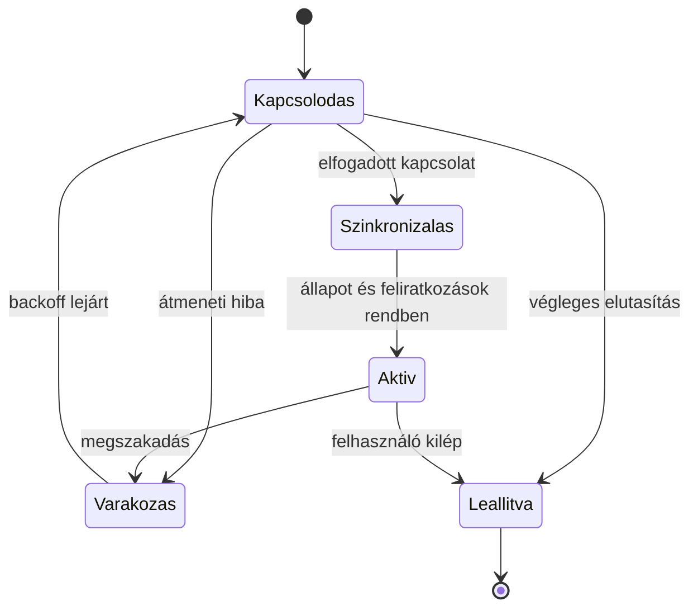

# 08.03. Heartbeat, újracsatlakozás és állapot-visszaszinkronizálás

A tartós kapcsolat megszakadhat hálózatváltás, proxytimeout, szerverkiesés vagy kliensalvás miatt. A kliensnek és a szervernek közösen kell megterveznie, hogyan ismerik fel a megszakadást és hogyan állítják helyre az alkalmazási állapotot.

## Heartbeat és időkeret

Heartbeatnél az egyik fél rendszeres életjelet vár. A határidő legyen összhangban a proxy idle timeoutjával, a várható hálózati késéssel és a kliens korlátaival. A túl rövid határ felesleges bontást okozhat; a túl hosszú későn ismeri fel a kiesést.

Böngésző háttérlapja és eszközalvása késleltetheti az időzítőket. A szerver nem feltételezheti, hogy minden kliens pontosan ugyanabban az ütemben fut. Az alkalmazási heartbeat a kapcsolat és a feldolgozó életképességét mérheti, de egy pong nem bizonyítja egy korábbi üzleti parancs sikerét.

## Újracsatlakozás backoffal

Azonnali, végtelen reconnect sok kliensnél túlterhelheti az újrainduló szervert. Exponential backoff és jitter szétszórja a próbálkozásokat. A várakozásnak legyen felső korlátja, és a nem javuló hitelesítési hibát ne kezeljük hálózati retryként.

Az `Aktív` állapot nem a TCP-kapcsolat felépülésétől indul, hanem a szükséges hitelesítés és szinkronizálás után. Így a kliens nem tesz úgy, mintha friss adatot mutatna, miközben még lemaradt állapotot használ.

## Visszajátszás eseményazonosítóval

A kliens megőrizheti az utolsó alkalmazott eseményazonosítót. Újracsatlakozáskor ettől a ponttól kér folytatást. A szervernek valóban elérhető és jogosultság szerint szűrt naplót kell biztosítania. Egy tetszőleges `lastId` mező nem teremt tartós visszajátszási képességet.

Ha a megőrzési idő lejárt vagy a folytatási pont ismeretlen, a szerver resyncjelzést adhat. A kliens friss snapshotot kér, majd annak verzióhatárától veszi át az eseményeket. Különben rés keletkezhet a snapshot lekérése és a feliratkozás között.

## Snapshot és stream versenyhelyzete

Ha először snapshotot kérünk, majd feliratkozunk, közben történhet kihagyott változás. Ha először streamet nyitunk, majd snapshotot kérünk, az események és a pillanatkép összefésülése kell. Egy közös verzió vagy kurzor teszi eldönthetővé, mely események vannak már benne a snapshotban.

A kliens az ismételt eseményt felismerheti azonosító vagy verzió alapján. Deltaüzenetnél a hiányzó előzmény újraolvasást igényelhet. Teljes állapotüzenetnél egy újabb verzió adott esetben felülírhatja a régebbit. A két reprezentáció más helyreállítási szabályt ad.

> [!important] A reconnect kapcsolatot állít helyre, nem állapotot
> A feliratkozásokat, a kimaradt eseményeket és a folyamatban levő parancsok eredményét külön rendezni kell.

## Ellenőrző kérdések

1. Miért nem elég új socketet nyitni a kapcsolatvesztés után?
2. Hogyan zárnád be a snapshot és a stream közötti rést?
3. Milyen állapotot mutasson a felület a szinkronizálás alatt?
