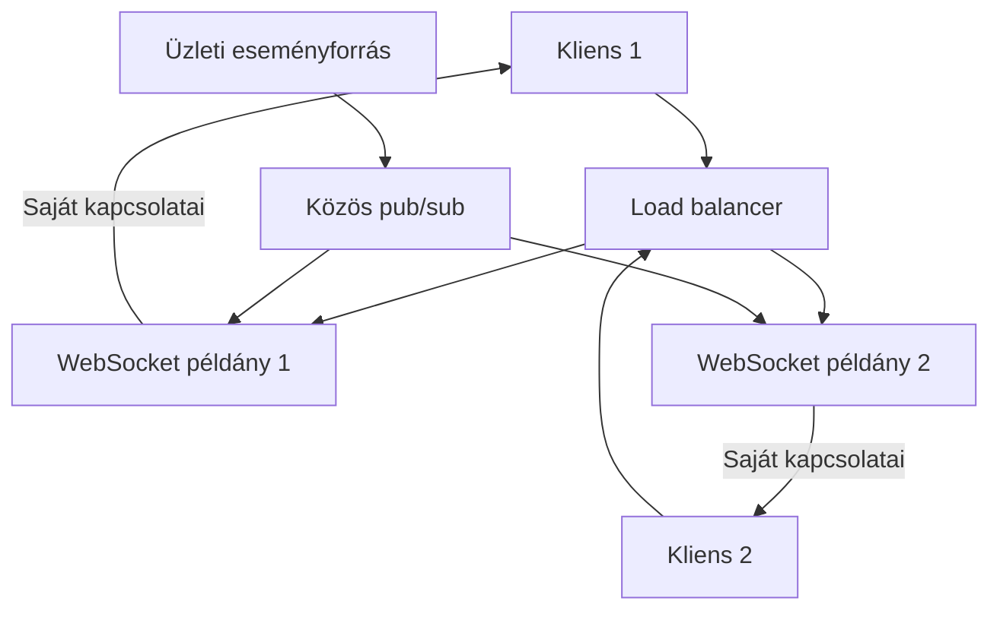

# 08.04. WebSocket skálázása és lassú kliensek kezelése

Egy WebSocket-kapcsolat jellemzően egy konkrét szerverpéldányhoz kötődik a fennállása alatt. Több példánynál ezért a rendszernek tudnia kell, melyik kapcsolathoz melyik eseményt kell továbbítani. A terheléselosztás új kapcsolatot helyez el; a már nyitott kapcsolatot nem mozgatja észrevétlenül másik folyamatba.

## Lokális és megosztott állapot

A socketobjektum és a közvetlen küldési puffer a fogadó példány memóriájában van. A felhasználó identitása, a feliratkozások és a folytatási pont egy része lehet tartós vagy megosztott. A megosztás nem azt jelenti, hogy egy másik processz ugyanazt a socketobjektumot használja.

Az ábra egyszerű broadcastmodellt mutat. Sok példánynál célszerű lehet csatorna- vagy célalapú elosztás, hogy ne minden szerver kapjon minden eseményt. A közös pub/sub sem feltétlenül tartós visszajátszási napló: a két feladatot külön tervezzük.

## Sticky session és kiesés

Sticky session bizonyos többkéréses vagy fallbacktransportos megoldásoknál szükséges lehet, és az ismételt kapcsolatokat ugyanahhoz a példányhoz terelheti. Egy már nyitott WebSocket természetesen ugyanazon kapcsolat célján marad. A stickiness nem helyettesíti a közös eseményterítést és a szerverkiesés utáni resyncet.

Ha a példány kiesik, a kliens másik példányhoz kapcsolódhat. Ennek újra kell ellenőriznie a jogosultságot és helyre kell állítania a feliratkozást. A csak lokális memóriában tárolt üzleti állapot elveszhet, ezért tartós parancseredmény ne kizárólag socketmemóriában éljen.

## Lassú kliens és puffer

A szerver gyorsabban termelhet eseményt, mint ahogy a kliens fogadja. A puffer korlátlan növelése memóriakimerülést okozhat. A kapcsolat száma mellett a ki nem küldött bájtok, üzenetek és a legöregebb adat kora is fontos.

Aktuális állapotnál összevonható több frissítés a legújabbra. Fontos üzleti eseményeknél tartós napló és későbbi folytatás szükséges. Túl lassú kliens bontása indokolt lehet, ha a protokoll egyértelműen megmondja a helyreállítás módját. A böngészős hagyományos WebSocket API nem ad automatikus, teljes körű fogadói backpressuremodellt.

## Kivezetés és graceful shutdown

Leállításkor a példány ne kapjon új kapcsolatot. A meglévőket korlátozott idő alatt lezárhatja vagy újracsatlakozási jelzéssel másik példányra terelheti. A tömeges bontás reconnecthullámot okozhat, ezért fokozatosság és jitter szükséges.

A proxykonfiguráció támogatja a kapcsolatfelépítést és az elvárt idle időt. Köztes bufferelés, rövid timeout és maximális kapcsolatszám eltérő hibákat okozhat. A kapacitást valós kapcsolathosszal, üzenetmérettel és lassú klienssel kell mérni.

> [!tip] Ne csak kapcsolatszámra skálázz
> Az üzenetütem, a fan-out, a puffer és a CPU-feldolgozás is számít. Tízezer csendes kapcsolat más terhelés, mint ezer aktív stream.

## Tervezési feladat

Három szerverpéldány előtt van egy load balancer, és minden felhasználó saját rendeléseinek eseményeit kapja. Tervezd meg az esemény továbbítását, a jogosultsági szűrést, a szerverkiesést és a lassú kliens bontását. Jelöld, mely állapot lokális, megosztott és tartós.
