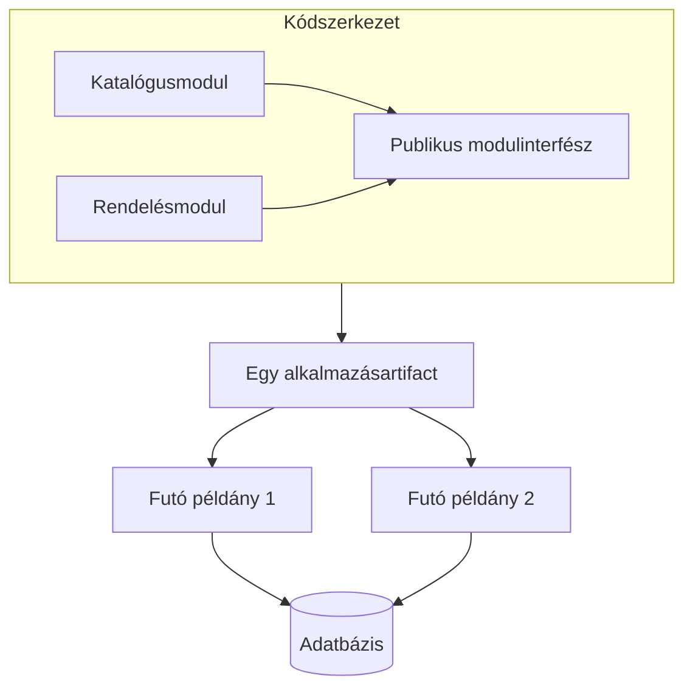

# Architektúra: kód, folyamat és telepítés

Egy rendszer architektúrája a fontos részeket, a közöttük levő kapcsolatokat és a változtatást korlátozó döntéseket írja le. A „monolit vagy mikroszerviz?” kérdéshez először azt kell megmondani, milyen határról beszélünk. A forráskód mappái, a futó folyamatok és a kiadható egységek három különböző nézetet jelentenek.

## Három egymástól független nézet

**Kódszerkezet:** melyik modul milyen felelősséget visel, mit exportál, és mit használ más moduloktól? Egyetlen alkalmazáson belül is lehet szigorúan szétválasztott számlázás, katalógus és ügyfélkezelés. A határt itt fordítási szabály, csomagláthatóság vagy architektúraellenőrzés tartja fenn.

**Futási szerkezet:** hány folyamat fut, hol tartják az állapotukat, és hogyan kommunikálnak? Két külön folyamat között nincs közös verem és közvetlen függvényhívás. Az adatot át kell alakítani üzenetté, továbbítani és a másik oldalon értelmezni. Egyetlen logikai szolgáltatás több példányban is futhat.

**Telepítési szerkezet:** mi adható ki és állítható vissza önállóan? Ha öt folyamat minden változtatását együtt kell kiadni, a folyamatok száma ellenére erős kiadási csatolás maradt. Ha egy monolitból tíz azonos példány fut, az továbbra is egy alkalmazás több példánya.

Az ábrán két példány és több modul szerepel, mégis monolitikus a telepítési egység. A példányok számát a terhelés miatt emeltük; a felelősségeket nem választottuk külön szolgáltatásokba.

## Architektúra és technológiaválasztás

A programozási nyelv vagy keretrendszer önmagában nem határozza meg az architektúrát. Ugyanazzal a nyelvvel készülhet monolit és több önálló szolgáltatás. A konténer csomagolási és futtatási eszköz: egy konténerbe csomagolt alkalmazás még nem mikroszerviz.

A rendszer értékelésekor konkrét változtatást vizsgálunk. Ha új fizetési mód kerül be, hány modul és szolgáltatás változik? Hány csapatnak kell egyeztetnie? Mi telepíthető külön? Mi történik, ha a fizetési szolgáltató nem válaszol? Ezekre a kérdésekre a technológiák felsorolása nem ad választ.

## Minőségi célok és mérhető következmények

A „gyors” és a „skálázható” túl általános követelmény. Értelmezhető cél például: egy katalógusoldal válaszainak 95%-a 300 ms alatt érkezzen meg adott terhelés mellett; a katalógus frissítése ne igényeljen számlázási kiadást; a keresés kiesése mellett a rendelés továbbra is fogadható legyen.

Egy döntés több célt egyszerre befolyásol. A hálózati határ lehetővé tehet külön skálázást, de növeli a késleltetést és a hibakezelés költségét. A helyi tranzakció egyszerűbb, de közös adatmodellhez kötheti a részeket. Nincs minden helyzetre legjobb architektúra: követelményekhez és szervezeti képességekhez mérünk.

> [!important] Ne a dobozok számát értékeld
> A modulok száma, a folyamatok száma és az önállóan kiadható szolgáltatások száma eltérhet. Az ábrán mindig nevezd meg, melyik határt mutatod.

## Ellenőrző kérdések

1. Egy alkalmazás hat példányban fut. Ettől mikroszervizes lett? Indokold meg a telepítési egységek alapján.
2. Két szolgáltatás külön repóban van, de közös kiadás kell hozzájuk. Milyen csatolás maradt?
3. Fogalmazz meg egy mérhető teljesítménycélt és egy önálló kiadhatósági célt ugyanarra a rendszerre.
