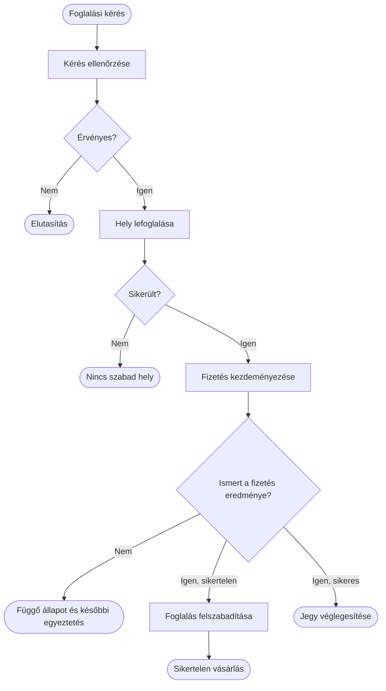

# Folyamatábrák, döntések és párhuzamos lépések

A folyamatábra a végrehajtás lépéseit és a köztük levő vezérlési kapcsolatot mutatja. Akkor hasznos, amikor a kérdés az, milyen feltételek mellett mi történik. Egy architektúraábra a komponenseket nevezi meg; egy folyamatábra a művelet lehetséges útjait.

## Egy folyamat felépítése

Kezdjük az indító eseménnyel, majd soroljuk fel a fontos lépéseket. A döntési pontot kérdésként fogalmazzuk meg, a kimenő ágakat feltételekkel címkézzük. A folyamatnak legyen értelmezhető vége: siker, elutasítás, várakozás vagy emberi beavatkozás.

Az ábra külön kezeli a sikertelen fizetést és az ismeretlen eredményt. A timeoutból nem következik, hogy a szolgáltató nem terhelte meg a kártyát. A „nem kaptunk választ” nem ugyanaz a döntési feltétel, mint a „visszautasította”.

## Aktivitás és felelősség

Az aktivitásdiagram a folyamat mellett felelősségi sávokat és párhuzamosságot is jelölhet. A sávok megmutatják, melyik szereplő vagy komponens hajtja végre a lépést. Mermaid `flowchart` és `subgraph` segítségével készíthető ehhez hasonló nézet, de az általános nyilak nem hordozzák automatikusan az UML aktivitásjelölés minden szabályát.

Párhuzamos lépések rajzolásakor nevezzük meg az összekapcsolás feltételét. Ha két ellenőrzés egyszerre indul, mindkettő eredményét várjuk? Elég az első siker? Az első hiba megszakítja a másikat? Egy kettéágazó nyíl önmagában erre nem ad választ.

## Hibaágak és ismétlés

A hibaágat a művelet jelentése szerint nevezzük el. A validációs hibát nem érdemes ismételni, az átmeneti hálózati hibát esetleg igen. Ha retryhurok szerepel, legyen felső korlátja és kilépési feltétele. A „hiba → újrapróbálás” végtelen nyíl működési szabály nélkül hiányos terv.

A kompenzáció külön művelet. A foglalás felszabadítása nem feltétlenül a korábbi kód visszafelé futtatása, és maga is hibázhat. A folyamatábra ezért mutathat helyreállításra váró állapotot. Ez nem részletkérdés: megmondja, ki és hogyan folytatja a félbemaradt műveletet.

> [!warning] A rajzolt nyíl nem végrehajtási garancia
> A folyamat leírása mellé meg kell adni a tartós állapotot, az ismételhetőséget és a hibakezelést. Az ábra nem teszi atomivá a több szolgáltatásból álló folyamatot.

## Mermaid-készítés lépésenként

Használj rövid, stabil csomópontazonosítókat, például `A`, `Validate`, `Reserve`. A feliratot írd külön, idézőjelbe, így az ékezetes szöveg és az írásjelek egyértelműek. A `TD` irány felülről lefelé, az `LR` balról jobbra rendezi az ábrát. Egy hosszú folyamatot inkább bonts több nézetre, mint hogy minden apró implementációs lépést egyetlen lapon tarts.

A forrás legyen verziókezelhető szöveg, és az ábrát mindig a környező magyarázattal együtt frissítsd. A pontos nyelvtanhoz: [Mermaid flowchart](https://mermaid.js.org/syntax/flowchart.html).

## Elemzési feladat

Rajzolj folyamatábrát egy webhook fogadásáról: aláírás-ellenőrzés, duplikációvizsgálat, tartós mentés, feldolgozás és nyugtázás. Jelöld, melyik hiba után várható újraküldés, és mi védi a kétszeri feldolgozástól a rendszert.
